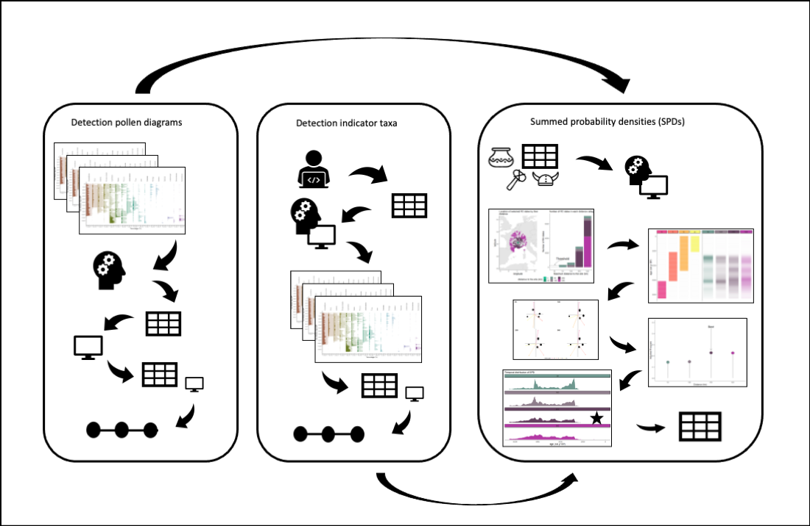
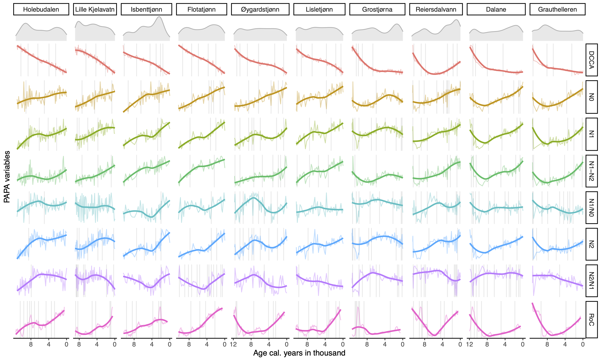

### Updates

The objective of this report is to give an overview of data inputs, data processing steps, data analysis, and results to determine whether human activity has changed the fundamental ecological processes over the last 8500 years (Hypothesis 1 in the HOPE project). 

From the first time the report was sent out, the methodological updates are not extensive, but there are some changes that might affect the overall results. The maximum age limit has been set to 8500 years. All record have been assigned ecozones. The density diversity and turnover variables have been included in the response data, and other pending and technical issues have been fixed. The data and results have been checked, and a new summary of the results is provided in the end. 

This report contain more or less the final results that will form the basis for a proper manuscript draft.


<br>


# Part I: Methodology

## Main data aquisition

### FOSSILPOL

The compilation of the main pollen dataset for our analysis is performed a priori.
Raw pollen datasets are carefully selected with the *R-Fossilpol* package, and the guidelines to the workflow are well described in Flantua et al. 2023 and in our website [Fossilpol project](https://hope-uib-bio.github.io/FOSSILPOL-website/about.html). Most datasets are obtained from the [Neotoma Paleoecology Database](https://www.neotomadb.org). Some additional data are from private owners in areas with data gaps, which we have limited access to use. We do not have the intellectual property rights to make these data public available. Therefore, only the derivatives of the analysis can be publicly shared. Table 1 provides a summary of the settings used in the FOSSILPOL workflow to obtain a standardised project dataset.  

### Harmonisation tables

An important step in FOSSILPOL to obtain a standardised pollen data set within and across regions is the harmonisation of pollen types. Different analysts have different backgrounds and schools using different nomenclature, and the level of pollen taxonomic identifications and names can vary widely. To be able to make numerical comparisons of different pollen records, the level of pollen taxonomy should be similar. Consequently, pollen harmonisation tables have been produced for different regions to try to minimise biases related to this. The regional harmonisation tables created in our project are for Europe, Levant, Siberia, Southern Asia, Northern America, Latin America, and the Indo-Pacific region (Birks et al. harmonisation paper). These tables are used as input in the Fossilpol workflow above ([see Fossilpol step_by_step guide](https://hope-uib-bio.github.io/FOSSILPOL-website/step_by_step_guide.html)).
<br>

```{r echo = FALSE, warning = FALSE, message = FALSE}

library(tidyverse)
library(usethis)
library(targets)
library(here)
library(colorspace)
library(colorBlindness)
library(data.tree)
library(kableExtra)
library(htmltools)

# list R functions and source them
lapply(
  list.files(
    path = here::here("R/functions"),
    pattern = "*.R",
    recursive = TRUE,
    full.names = TRUE
  ),
  source
) %>%
  invisible()

auth_tibble <-
  tibble::tibble(
    name = c("ondre", "omo084", "vfe032", "vfe032", "sfl046", "kbh022"),
    paths = c(
      "C:/Users/ondre/OneDrive - University of Bergen/HOPE_data/",
      "C:/Users/omo084/OneDrive - University of Bergen/HOPE_data/",
      "/Users/vfe032/Library/CloudStorage/OneDrive-SharedLibraries-UniversityofBergen/Ondrej Mottl - HOPE_data/",
      "C:/Users/vfe032/OneDrive - University of Bergen/HOPE_data_copy/",
      "C:/Users/sfl046/University of Bergen/Ondrej Mottl - HOPE_data/",
      "C:/Users/kbh022/University of Bergen/Ondrej Mottl - HOPE_data/"
    )
  )

sys_info <- Sys.info()

username <-
  sys_info["user"]

data_storage_path <-
  auth_tibble %>%
  dplyr::filter(name == username) %>%
  purrr::pluck("paths")

if (length(data_storage_path) > 1) {
  data_storage_path <- data_storage_path[2]
}

external_storage_targets <-
  paste0(
    data_storage_path,
    "HOPE_Hypothesis1/_targets1"
  )

# set configuration for _target storage
tar_config_set(
  store = external_storage_targets
)


min_age <- 0
max_age <- 12e3
timestep <- 500

# set colours 
# five main ecozones
palette_eco <- c("#222255", "#009988", "#117733", "#DDCC77", "#CC6677") 
#human vs climate
palette_pred <- c("#663333", "#BBBBBB") 

```

```{r echo = FALSE}

data_geo_koppen <- get_file_from_path(paste0(data_storage_path, "HOPE_Hypothesis1/Data/ecoregions2017/data_geo_koppen.rds"))
```


```{r echo = FALSE}
file_path <- paste0(data_storage_path, "HOPE_Hypothesis1/Data/assembly/data_assembly-2022-05-23.rds")

data_settings <- get_file_from_path(file_path) %>% 
  pluck("setting")
```

```{r echo = FALSE, warning = FALSE, message = FALSE}

options(knitr.table.format = "html") 

tab_gen <- data_settings$general %>% 
  unlist %>% 
  as.data.frame() %>%
  rownames_to_column("Setting type") %>%
  rename(Selection = ".") 

tab_neo <- data_settings$Neotoma %>%
  unlist %>% 
  as.data.frame() %>%
  rownames_to_column("Setting type") %>%
  rename(Selection = ".") %>%
  filter(!grepl("chron_order.order", `Setting type`))

tab_age <- data_settings$age_depth_models %>%
  unlist %>% 
  as.data.frame() %>%
  rownames_to_column("Setting type") %>%
  rename(Selection = ".") 

tab_site <- data_settings$site_filtering %>%
  unlist %>% 
  as.data.frame() %>%
  rownames_to_column("Setting type") %>%
  rename(Selection = ".") 

overview_table <- tab_gen %>% 
  mutate(Selection = as.character(Selection)) %>%
  full_join(tab_neo) %>%
  full_join(tab_age %>% 
              mutate(Selection = as.character(Selection))) %>%
  full_join(tab_site %>% 
              mutate(Selection = as.character(Selection))) %>%
  mutate(Selection = ifelse(Selection == 1, TRUE, Selection))

overview_table %>%
  kableExtra::kbl(booktabs = TRUE, caption = "Table 1: Selection of settings applied in FOSSILPOL") %>%
  kableExtra::kable_paper(full_width = FALSE)  %>%
  kableExtra::pack_rows("General", 1, 7) %>%
  kableExtra::pack_rows("Neotoma", 8, 15) %>%
  kableExtra::pack_rows("Age-depth\n models", 16, 24) %>%
  kableExtra::pack_rows("Site filtering", 25, 36)

```
<br>
<br>

## Workflow for HOPE Hypothesis 1

We use the [targets](https://books.ropensci.org/targets/) R-package to generate a reproducible workflow for all data processing, analysis, and visualisation of results in the project. For this purpose, we created a Github repository of the data analysis R-project called [HOPE_hypothesis1 in Github](https://github.com/HOPE-UIB-BIO/HOPE_Hypothesis1), which contains all the data, metadata, and R functions required to run this R-project.

We configured the output of targets to be stored in a shared folder in UiB Onedrive, while the scripts and functions for targets are stored in our Github repository. The targets are divided in many small steps with specialized functions to load necessary data, estimate the different variables or to structure the different subsets of the data. This will avoid the need to rerun major parts between us that take too long and has already been processed. If any changes are made in the functions, targets will automatically detect it and rerun the parts that depends on this change, and skip the up-to-date analysis. 

<br>

The file structure in Github is

```{r echo = FALSE, warning = FALSE, message = FALSE}
# create paths
path <- c(
  "HOPE_Hypothesis1/",
  "HOPE_Hypothesis1/___Init_project___.R",
  "HOPE_Hypothesis1/_targets.R",
  "HOPE_Hypothesis1/_targets_packages.R",
  "HOPE_Hypothesis1/HOPE_Hypothesis1.Rproj",
  "HOPE_Hypothesis1/R/",
  "HOPE_Hypothesis1/renv/",
  "HOPE_Hypothesis1/R/functions/",
  "HOPE_Hypothesis1/R/functions/climate/",
  "HOPE_Hypothesis1/R/functions/data_wrangling/",
  "HOPE_Hypothesis1/R/functions/events/",
  "HOPE_Hypothesis1/R/functions/hvarpart/",
  "HOPE_Hypothesis1/R/functions/modelling/",
  "HOPE_Hypothesis1/R/functions/PAPs/",
  "HOPE_Hypothesis1/R/functions/spd/",
  "HOPE_Hypothesis1/R/functions/visualisation/"
  )
  

(filetree <- data.tree::as.Node(data.frame(pathString = path)))

```

All that is needed when the R-project is set up, is to run the scripts `___init_project.R___` and `_targets.R`. This will install and load all the packages that are needed.
<br>


The targets are arranged in a order to prepare all the data needed for the main analysis in the end. 

1. The first steps of the workflow imports and load all data needed for the pre-processing data steps and analyses such as the final HOPE dataset compilation and other input tables e.g human event-types for different regions. 

2. This is followed by data processing for each of the explanatory and response variables in H1: 
- a) The largest pre-processing of data starts with preparation of the explanatory variable detecting past human presence and impact. This is a major analyses in itself. 
- b) This follows by data extraction of palaeo-climate from the CHELSA paleoclimate database. This is modeled palaeo-climate data for each of the geographical location of the pollen records. First time the function is run, it will download the data from a URL connection, and extract data for the climatic variables selected, and deleted the data that is not needed to save storage in local computer. 
- c) It is followed by different targets that process all estimates of the response variables selected to get measures of ecosystem properties. In general, all data such as raw estimates and interpolated data are kept to allow careful checking and validation of output. 

3. In the end, data is structure to fit the main analysis. This analysis is divided into two parts which we call the 
- a) the spatial (within core) analysis, and 
- b) the temporal analysis (a *spatial* or between core/sample analysis per timestep ca. every 500 years). 

Several choices are made, which are described in the detail in the text below.
<br>


### Data filtering

The main data is divided into the targets named `data_assembly`, which stores all pollen records and chronology tables, and the targets named `data_meta`, which contain general site information. We have applied a number of filtering criteria to obtain as high a data quality as possible so that we can compare the numerical estimates on standardised data sets. These filtering criteria are: remove potentially duplicated pollen records, sorting levels (samples) by age, remove levels (samples) lower than a threshold of total number pollen grains counted (= pollen sum), remove pollen records based on age (minimum and maximum age ranges), remove levels (samples) depending on the age of the last control point, remove samples beyond the age ranges of interest, and remove pollen records if the total number of samples (N) is too low.

This filtering is done on the chronologies, raw pollen counts, harmonised pollen counts, and the age uncertainties from the age-depth models (Bchron). The preferable number of minimum pollen grains is set to 150, but this led to a great loss of datasets in regions with less data coverage, and we therefore reduced this number to 25 with the condition that less than 50 % of the samples must have a low pollen sum. This allow us to keep more datasets, but in the cases pollen records have a low minimum pollen sum, we acknowledge that the estimates of pollen assemblage properties (PAPs) are less robust. The maximum age beyond extrapolation is set to 3000 years because ages extrapolated beyond this threshold is considered highly uncertain. Finally, pollen records with less than 5 samples are removed for further analyses. The final HOPE dataset compilation used further in our project is called the `data_assembly_filtered`.

<br>


### Detection of past human presence

To determine the impact of past humans on fundamental ecosystem properties, we need to develop indicators of past human presence and activity. This led to the development of a new method (see next figure) where we use human event detection and indicators identified from pollen records based on expert knowledge (left and middle), combined with the method for quantifying human presence based on radiocarbon dates derived from archaeological artifacts and Summed Probability Densities (SPD, right) (Bird et al. 2022). We believe that this solves the issue that we can use a standardised variable as indicator of past human impact, and partially avoids the difficulty of creating standardised variables to detect human disturbance events across different regions and continents. This may reduce the potential circularity of human detection events derived from the same pollen records as the estimates of ecosystem properties.  



<br>

#### *Detection of human events*

For each pollen record, we have detected periods of human presence from the pollen data. Two methods have been used: i) detection from pollen diagrams (North America, Europe, Asia, Indopacific; ii) detection using indicator taxa (Latin America).  
<br>

#### *Detection of human events in pollen diagrams*  

First, a pollen diagram of each pollen record has been examined by a regional expert and the age of each event type has been recorded.


```{r echo = FALSE, warning = FALSE, message = FALSE}

event_table <- data.frame(Region = c("North America", "Europe", "Asia", "Indopasific"), 
                          `Event-type` = c(
                            paste("BI = Before Impact; FC = First Cultivation; ES = European Settlement"),
                            paste("BI = Before Impact; FI = First Indication; FCu = First Cultivation; EC = Extensive Clearance; CC = Complete Clearance"),
                            paste("BI = Before Impact; FI = First Indication; FCu = First Cultivation; EI = Extensive Impact"),
                            paste("no_impact = No Impact; weak = Weak Impact; medium = Medium Impact; strong = Strong Impact")))

event_table %>%
  kbl(booktabs = TRUE, caption = "Table 2: Type of human events identified in pollen diagrams", align = "l") %>%
  kable_paper(full_width = FALSE)


```

<br>

Note that the event types are uniquely defined within continents, and event types with the same name have different meanings between continents.    


Second, an algorithm is made to obtain the binary variables (0/1) associated with each event type that is identified in each pollen record. A new vector with the average ages in between levels (samples) of the identified event type was created because the time of the events is assumed to have occurred prior to the changed event. A new matrix was created that uses the new age vector with the events type. The different event types are assigned binary values (0/ 1) depending on if the event type is present (i.e. when the age of the specific event is detected). Ultimately, logical principles were followed and the binary values were adjusted to get the event data for each pollen record. If no human event is recognised, it does not necessarily mean that humans were absent, but instead that there was not enough information to identify human activity in the pollen records.  

Below is a figure that intends to represent the underlying raw data associated with human events. To simplify the data, they are aggregated by ecozones and regions, instead of individual datasets. The different colours represent the differnet types of human events in each region. The raw event types is represented by the data that indicates whether or not the event occured (the circle dots on the y-axis are 0 or 1). The smooth trend lines represent simple binomial GAM models for each ecozone that show the main trends and alteration in the timing of events over time. For example to interpret this figure, it demonstrate that in the Cold ecozone of Europe, human impact (bi = before impact) was not observed in any of the datasets before around 7000 years BP, however, *bi* then declined steadily over time, other events that were identified began to become visible. The first indication (fi) of human interference begins to increase around 7500 years BP when *bi* is dropping. The first indication of humans increase steadily in this ecozone up to around 2500 years BP before it begins to decline. After that, the other relevant events types become apparent, such as the first cultivation (fc) increase, followed by an increase in signs of early clearance (around 3000 years BP). Complete clearance is only documented in the latter part, around 2000 years, when it increased to the present time (but this is not extensive across the pollen records, the highest proportion is around 0.25.  

<br>


```{r echo = FALSE, warning = FALSE, message = FALSE}

data_events <- targets::tar_read(data_events_to_fit)


plot_data_events(
  data_source_events = data_events,
  select_region = "Europe"
)

plot_data_events(
  data_source_events = data_events, 
  select_region = "North America"
  )

plot_data_events(
  data_source_events = data_events,
  select_region = "Asia"
)

plot_data_events(
  data_source_events = data_events,
  select_region = "Oceania"
)


```

<br>
<br>

#### *Detection using indicator taxa*

The methodology for identifying past human activity in Latin America is slightly different. An extensive literature review has been devoted to the detection of pollen types that are associated with human activity. The composition of indicator groups varies across the continent, regions, and countries. Two tables are created from the literature review (see Table 3 and Table 4). A computer algorithm has been created to assess each pollen record, this algorithm traverses the combinations of taxa that are recorded along with the specific indicator groups, and determined if the signal of a pollen indicator for human activity is weak or strong based on a defined threshold.  

<br>

Table 3 for human event indicators:  


```{r echo = FALSE, warning = FALSE}
human_indicator_table <- read.csv(paste0(data_storage_path,"Hope_human_events_external_storage/LAPD_Human indicators_V9.csv"), encoding = 'latin1')

human_indicator_table %>% 
  dplyr::select(pollen.type:Evidence) %>%
  kable %>%
  kable_styling("striped", full_width = F) %>% 
 scroll_box(width = "700px", height = "400px")
```
  
<br>
<br>

Table 4 for human event indices:  


```{r echo = FALSE, warning = FALSE}

human_impact_table <- read.csv(paste0(data_storage_path,"Hope_human_events_external_storage/LAPD-Human impact indices_V8.csv"), encoding='latin1')

human_impact_table %>% 
  dplyr::select(HOPE.USE:REFERENCES, EVIDENCE) %>%
  kable %>%
  kable_styling("striped", full_width = F) %>% 
 scroll_box(width = "700px", height = "400px")
```

<br>
Two categories were created: i) 'human event indicators': a single taxa associated with human activity classified as 'weak' or 'strong' impact; ii) 'human event indices': a combination of particular taxon is classified as 'weak' or 'strong' impact. For each level of each pollen record, all indicators and indices were tested for its presence in the level and whole level we classified as "no impact", "weak impact" or "strong impact". Specifically, when one pollen grain of a human indicator is present, it is assigned as 'weak' and when more than 1 pollen grain of a strong impact indicator is present we assign it as 'strong'. In addition, the pollen-type *Pinus* was only considered as a human indicator outside of its native distribution. For indices, any number of pollen grain needs to present for that specific combination.

<br>

Summary figure of the events using indicator taxa in different ecozones in Latin America:  

```{r echo = FALSE, warning = FALSE, message = FALSE, fig.align='left'}

data_events <- targets::tar_read(data_events_to_fit)


plot_data_events(
  data_source_events = data_events,
  select_region = "Latin America"
)

```
<br>
<br>

#### *Arcehological artefacts and Summed Probability Densities*

We used the global dataset of radicarbon dates (RC dates) of archeological artefacts from Bird et al. 2022. The quantification of SPD requires a distance to be selected around each site location to collect the relevant dates of archaeological artefacts around it. This will limit the area of human presence and indirectly the amount of human activity relevant to pollen records from each site.  

Only RC dates with valid geographical location (longitude and latitude), and 'LocAccuracy' \> 0 were selected. For each pollen record, RC dates were classified by the geographical distance to the pollen record. The chosen distance classes were: 5, 25, 50, 100, 250, 500 km.  

For each pollen record, one variable of SPD´s in time was calculated for each distance class. Radiocarbon dates were calibrated using `calibrate` function from `rcarbon` package with appropriate calibration curves ("IntCal20", "ShCal20", "mixed"). Calibration curves were obtained `rcarbon` package and "mixed" was created using `rcarbon::mixCurves` function with 'p' = 0.5. Calibration curves were assigned by their geographical location following Hua et al., 2013.  

SPD is estimated using `spd` function from `rcarbon` package for each distance class for each year between a minimum threshold age and 12 ka. However, distance class with less than 50 RC dates is filtered out in order to maintain robust SPD estimation. The minimum threshold ages are different for different regions and are decided based on the availability of radiocarbon dating for different regions. In general there is a bias that radiocarbon dating is rather limited on younger material where in many regions there are a lack of C14 data during the last 2000 years. Table 5 show the ages where data younger than age_from where removed.  
<br>
<br>

```{r echo = FALSE, warning = FALSE, message = FALSE}

age_cutoff_rc <- data.frame(
    region = c("Europe", "Latin America", "Asia", "Africa", "North America", "Oceania"),
    age_from = c(2000, 2000, 2000, 2000, 500, 500)
  )

age_cutoff_rc %>%
  kbl(booktabs = TRUE, caption = "Table 5: Minimum ages above which C14 data was removed (age_from) for different regions", align = "l") %>%
  kable_paper(full_width = FALSE) 

```
<br>
<br>

In order to select distance from each pollen record, which will limit the area of human activity relevant to that pollen record, we used the expert-based detection of human events and the human impact detection from indicators of pollen types to inform the estimation of SPD:

For each distance class of SPD of each pollen record, one Redundancy Analysis (RDA) is estimated using `vegan::rda` function with event types as responses (binary) and SPD values as predictors. Next, R2 is estimated using `vegan::RsquareAdj` function for each distance class. Finally, the distance class with the highest R2 is selected as the representation of human presence, and indirectly human activity, for that pollen record.

This approach is not perfect and it is neglecting topographic differences and presence of water bodies. However, this was selected as a balance between simplicity and generality, and to avoid unnecessary increase of complexity in choosing the distance from the records. See demonstration of this method [Detection of past humans](https://github.com/HOPE-UIB-BIO/HOPE_Archaeo_C14/blob/master/R/07_Methodology%20example.md).  
<br>

```{r echo = FALSE, warning = FALSE, message = FALSE}
# data_to_spd_plot <- tar_read(data_spd_full) %>%
#   inner_join(targets::tar_read(data_meta) %>%
#                            dplyr::select(dataset_id, 
#                                          region, 
#                                          ecozone_koppen_5), 
#                        by = "dataset_id") %>%
#   dplyr::select(dataset_id, spd, region, ecozone_koppen_5) %>%
#   unnest(spd) %>%
#   filter(!is.na(spd))

# data_to_spd_plot %>%
#   ggplot(aes(x = age, y = spd, col = ecozone_koppen_5)) +
#   geom_point() +
#   scale_colour_hue(c = 50, l = 50, h = c(30, 300)) +  
#   geom_smooth() +
#   facet_wrap(~region, scales = "free") +
#   theme_classic() +
#   theme(legend.position = "bottom") 

```

<br>

### Paleo Climate

Paleoclimate from the CHELSA-TraCE21k downscaling algorithm is downloaded from the CHELSA database (Karger et al. 2021, Karger et al. 2021). The selected bioclimatic variables are annual mean temperatures ℃ (bio1), minimum temperatures of coldest month ℃ (bio6), annual precipitation kg m-2 year-1 (bio12), precipitation seasonality (bio15), precipitation of warmest quarter kg m-2 quarter-1 (bio18) and precipitation of coldest quarter kg m-2 quarter-1 (bio19), where we extracted climate values for the coordinates for each dataset_id retrieving the full time series of every 100 years. In addition, we downloaded the monthly climatology for daily maximum near-surface temperature K/10 (tasmin).  
<br>

### Pollen assemblage properties (PAP) estimation

To prepare the response variables of our main pollen dataset compilation and to be able to analyse fundamental ecosystem properties, we prepared the standard estimates of pollen assemblage properties (PAP) (Bhatta et al. 2023). The PAP estimations provide different aspects of pollen assemblage diversity which includes palynological richness, diversity and evenness, compositional change and turnover, and Rate-of-Change (RoC). 

These response variables are calculated using the newly developed [R-Ecopol package](https://github.com/HOPE-UIB-BIO/R-Ecopol-package) that contain all the functions needed to estimate PAPs for our pollen data assembly. The base functions used in this package are derived from other dependency packages such as `mvpart` package (Therneau et al. 2014) to estimate pollen zonations with multivariate regression trees, `vegan` (Oksanen et al. 2022) for other mutivariate techniques and dissimilarity indices, `R-Ratepol` (Mottl 2021) to get the estimates of RoC, functions from `iNext` (Chao et al. 2014) that have been modified to extract interpolated Hill numbers based on a minimum sample size, and newly developed R functions to run DCCA using `Canoco 4.5` (ter Braak xxxx) to list a few, among other, dependency packages.  

<br>

#### *Pollen richness, diversity, and evenness* 

The different aspects of palynological diversity are estimated using Hill´s effective species numbers N0, N1, N2, and the associated evenness ratios of N2/N1 and N1/N0. These are combined through one equation where the effective species numbers differ mainly in how the rare taxa are weighted in the parameter q:

$$^q{D} = (\sum_{i=1}^{S} p_{i}^{q})^{1/(1-q)}$$

When q is 0, rare and abundant taxa have equal weight and the number is simply the number of taxa in the sample. The equation is not possible to define for q = 1, but as it approaches 1, it is equal to the exponential of the well-known Shannon index and reports the number of equally common taxa. When q = 2, it is the same as the inverse Simpson diversity index and provides the number of equally abundant taxa with a low weight on rare taxa. The advantage of using effective species numbers is that they provide easily interpretable units and contain the doubling effect. To standardize the sample sizes, we use the rarefaction approach developed by Chao et al. These estimates are rarefied to the number of n = 150 grains, or in some cases to a lower sum (minimum n = 25). Some pollen records were only available as pollen percentages, and as the sample size is unknown, these are then rarefied to the minimum sum of percentages. The evenness ratios will be 1 if all taxa are equally abundant, and the ratios hence indicate changes in abundances between the numbers of rare, equally common, and abundant taxa.

We acknowledge that even though attempts are made to standardise richness and diversity estimates based on standard sample size, there are additional biases that are not taken into consideration such as differences in total pollen production and pollen representation (Odgaard 1998, 2001). In some cases, the total pollen sum is also too low to be considered a robust estimate, but it was a choice made on balancing loosing too much information from geographical areas with less data coverage (see data filtering above). 

<br>

#### *Compositional change*  

Compositional change is calculated using multivariate regression trees (MRT) with age as the constraining variable. MRT is in general a robust tool to explore and predict changes in multivariate data sets using environmental predictor variables (De´ath, Simpson and Birks 2012). This technique has been adopted in palaeoecology to detect major zones in pollen diagrams or shifts between periods of homogeneous vegetation in time (Simpson and Birks 2012). We use the pollen taxa in percentages without any data transformations as the response and the median ages derived from the age-depth model as the constraining variable. The recursive partitioning are based on chi-square distances between pollen samples constrained by time. The number of cross-validation is set to 1000, and the optimal sized tree is chosen based on the 1SD rule (Simpson and Birks 2012).  

<br>

#### *Compositional turnover*

Compositional turnover is estimated using detrended canonical correspondence analysis (DCCA) with age as the explanatory variable (ter Braak and Smilauer 2007?). Changes in Weighted average (WA) sample scores (CaseR scores sensu ter Braak and Smilauer 2012) are measures of compositional turnover in standard deviation (SD) units (Birks 2007). The WA scores are regressed with time using a second-order polynomial (age+age\^2) to allow more flexibility in the turnover pattern within a pollen record. Total compositional turnover is a measure of the total length of CaseR scores along the DCCA axis 1, whereas the pattern within a record is the measures between the individual samples along the DCCA axis 1. The response data are pollen percentages without any transformation to maintain the chi-square distances between samples, whereas the ages are the median ages derived from the age-depth model for each site.
<br>

#### *Rate-of-change*

Rate-of-change for the pollen assemblages in the pollen records are quantified using the novel [R-Ratepol package](https://github.com/HOPE-UIB-BIO/R-Ratepol-package) (Mottl et al. 2021). RoC is estimated using moving windows of 500 years´time bins of five number of windows shifts where samples are randomly selected for each bin. This approach is shown to increase the correct detection of RoC peak-points than the more traditional approaches (Mottle et al. 2021). RoC are reported as dissimilarity per 500 years using the Chord dissimilarity coefficient. Sample size is standardized in each working unit to 150 grains or the lowest number detected in each dataset. We use only the RoC scores further in the analyses. 
<br>

#### *Change-points detection and density estimates*

Change-points detection of all the PAP variables are calculated using conventional regression trees (RT) for single variables with Euclidean distances. An algorithm is made to detect the transitions between the resulting groups (or zones) per variable, and these are coded as new binary (0/1) variables. A change-point is defined as 1, where the mean ages between the two consecutive samples are used as the timing of this significant change. This is done individually for each PAP variable.

The significant change points of the richness, diversity, and evenness variables are combined into one variable, and the significant change points of compositional turnover, compositional change, and rate-of-change is combined in a second variable. The density of these two variables are calculated using a Gaussian kernel,and re-scaled to each of specific age ranges for each individual pollen record (i.e. minimum and maximum ages). To solve the boundary issue in density estimation the data is reflected to 0. We extract the interpolated values at every 500 years time step.


Conceptual figure to show the process:  

  

<br>
<br>

### Hierarchical variation partitioning

All response variables have been estimated using the harmonised pollen records for each location. To obtain estimates of equal spacing of 500 years, we used linear interpolation. In the context of the temporal analysis, where we analyse samples distributed in space across time, and equal time steps are necessary.

In order to choose a method of interpolation to obtain data on equal time steps, we compared the results of GAM to simple linear interpolation. By applying linear interpolation, we found that the correlation structure between the multivariate response variables are more similar to the original estimates without equal spacing than applying a GAM. The GAM model was able to show unexpected patterns in single PAP estimate that changed these correlations. Since we cannot individually assess all single GAM models for each of the variable in all of the records, we choose the simplest interpolation method. Similar issues were found when estimating the density variables of changes points. The first approach was to estimate densities of the individual change points, and then use hierarchical generalised additive models (HGAM) to find the common pattern between the two groups representing significant changes in richness, diversity, and evenness, or change in pollen assemblages (MRT, RoC, DCCA1). Some of the models did not converge and showed inconsistent results. As we cannot individually adjust all the models, we used the density estimates on the combined variables directly and extracted the interpolated values at every 500 years step. 

Before the analysis We remove Africa as a region, because we do not have data of *past human presence*.

To test if the ecological processes have changed due to past human activity in single records, we use reduced rank multivariate regression. This is also known as distance-based redundancy analysis (db-RDA). We used the R package `rdacca.hp` to run hierarchial variation partitioning with several predictors. This estimates the variation per variables in different combinations to get the average variable importance independent of the order of predictors. db-RDA was performed using *Gower-distances* adding a constant because our response data, the PAPS, is a mixture of numerical variables in different units. 

Depending on the type of analysis, the explanatory variables are either SPDs, time, and/or palaeoclimatic variables (see below). 

SPD is the variable of main interest as it represent past human presence. The palaeoclimate is a matrix of summer precipitation, winter precipitation, annual temperatures, and winter temperatures. These are selected as we considered them most relevant to represent major differences in climatic conditions in all the regions (in respect to differences in warm, cold, dry, wet, or regions with high seasonality). Time is represented by the ages of each pollen record, however, this is more difficult to interpret. We assume age may represent time dependent changes such as natural successions and/or ecological changes due to interaction between taxa.

In the hierarchichal variation partitioning analysis, the predictor variables can be applied either as individual predictors or as groups of predictors. In our case, we run the analysis with *groups of predictors*. This means that the palaeoclimatic variables are included as one matrix and not assessed as individual predictors. (The overall results is not very different from using individual predictors). 

Statistical testing can be applied in two ways, both which shuffle the predictor variables. Using `time_series` set as TRUE, statistical testing is performed with restricted Monte Carlo permutation for time series analysis (sensu ter Braak XXXX) which has a cyclic behavior of samples to keep the stratigraphical order intact. If `time_series` is set as FALSE, the predictor variables will be randomly shuffled as many times set in the parameter `permutations` (hence it use the default permutation in the `rdcca.hp` package).

The analysis is run in two different ways: 

1) to analyse *spatial changes* which run the hierarchical variation partitioning within single record. 
2) to analyse the *temporal patterns* in space for each of the 500 year time steps.

In this latter analysis, we restructure the data so that each analysis is run per time bin for each continent. First we did it for each ecozone on a continent, but the results is relatively similar so we use the continental scale. The predictor groups in each time bin are the past human presence and the matrix of palaeoclimatic variables. It was necessary to filter out time bins which have less than 5 samples, and for some bins, if all the spds equal zero, the analysis will fail. In this cases there is an insufficient numbers of predictors and the analaysus will return NA for these specific time bins.

We use the adjusted R2 to assess the goodness of fit of models. Adjusted R2 is the modified version of R2 that correct for number of samples and predictors in the model. It is calculated using the Ezekiel formula adjR2 = 1 - (1-R2)*(n-1)/ (n-m-1), where n = number of samples in the dataset, and m is the number of variables. In vegan these are so called semipartial R2 (Legendre et al. 2011). Adjusted R2 can be negative,in case the adjR2 for predictors are negative we replace the values with 0 as these can be ignore. 


<br>
<br>

# Part II: Results


In total, we have 1263 pollen records in the HOPE standardised dataset distributed across the different regions of North America, Europe, Asia, Latin America, and Oceania included in the analysis.

Inspection of the models show there are models with a very poor fit (= 13 models/records) with negative total adjR2. These models are removed. There are still some models that have an adjR2 close to zero, which may give very high unique percentages above 100 (range of adjR2 is 0.005 to 1). To remove the uncertain data points, we defined a minimum threshold of the adjR2 using the lower 5 % quantile of all adjR2. This removes models with an adjR2 < 0.121 from the summary (= 63 models/records). This leaves us with 1184 models (locations) that are considered good enough to be included in the the overall summary. 

The unique and average shared variances are recalculated as percentages of the total, and we summarise the results using the median unique and average shared percentages for the predictors in each ecozone in each region. If an ecozone have less than 5 records, it is not included in the summary. 

The temporal analysis is conducted on the regional level, showing the unique and average shared percentages for the predictors of total variance over each 500 years time steps up to 8500 years.


<br>
<br>


```{r echo = FALSE, warning = FALSE, message = FALSE}

# Import results
output_temporal <- tar_read(output_hvar_temporal)
output_spatial <- tar_read(output_hvar_spatial)


# Prepare  resulting tables 
# spatial
data_spatial_vis <- output_spatial %>% 
  left_join(tar_read(data_meta), 
            by = "dataset_id") %>%
  dplyr::select(dataset_id, 
                lat, 
                long, 
                region, 
                ecozone_koppen_5, 
                data_merge, 
                varhp) %>%
  dplyr::mutate(summary_table = 
                  purrr::map(varhp, 
                             pluck("summary_table"))) %>%
  unnest(summary_table) %>%
  dplyr::mutate(total_variance =
                  purrr::map_dbl(varhp, 
                                 .f = . %>% pluck("varhp_output") %>% 
                               pluck("Total_explained_variation"))) %>%
  mutate(across(Unique:`I.perc(%)`, 
                ~replace(., .x < 0, 0))) %>%# negative variances can be ignored
  dplyr::select(-c(data_merge, varhp)) %>%
  mutate(p_value = readr::parse_number(`Pr(>I)`)) %>%
  group_by(region, ecozone_koppen_5) %>%
  mutate(n_records = length(unique(dataset_id))) %>%
  ungroup() %>%
  mutate(Unique_percent = Unique/total_variance *100,
         Average.share_percent = Average.share/total_variance *100)  %>%
  dplyr::select(dataset_id:predictor, 
                total_variance, 
                Unique,
                Average.share,
                Individual,
                Unique_percent,
                Average.share_percent,
                `I.perc(%)`,
                p_value, 
                `Pr(>I)`, 
                n_records)

# temporal
data_temporal_vis <- output_temporal %>%
  dplyr::mutate(summary_table = 
                  purrr::map(varhp, pluck("summary_table"))) %>%
  unnest(summary_table) %>%
  dplyr::mutate(total_variance =
                  purrr::map_dbl(varhp, .f = . %>% pluck("varhp_output") %>% 
                                   pluck("Total_explained_variation"))) %>%
  mutate(across(Unique:`I.perc(%)`, ~replace(., .x < 0, 0))) %>% # negative variances can be ignored 
  mutate(Unique_percent = Unique/total_variance *100,
         Average.share_percent = Average.share/total_variance *100) %>%
  dplyr::select(-c(data_merge, varhp)) %>%
  mutate(p_value = readr::parse_number(`Pr(>I)`)) %>%
  ungroup() %>%
  dplyr::select(age:predictor, 
                total_variance, 
                Unique,
                Average.share,
                Individual,
                Unique_percent,
                Average.share_percent,
                `I.perc(%)`,
                p_value, 
                `Pr(>I)`, 
                n_samples)


# Filter out poor models

poor_models_spatial <- data_spatial_vis %>% 
  dplyr::filter(total_variance < 0) 

poor_models_spatial_ids <- data_spatial_vis %>% 
  dplyr::filter(total_variance < 0) %>%
  pluck("dataset_id") %>%
  unique()

# remove models with negative variance
data_spatial_vis <- data_spatial_vis %>%
  dplyr::filter(!dataset_id %in% poor_models_spatial_ids)


# get 5 % threshold:
lower_5_percent <- data_spatial_vis$total_variance %>% 
  quantile(., probs = 0.050, na.rm = TRUE) 


```


```{r echo = FALSE, warning = FALSE, message = FALSE}

# get summary tables for adjusted r2
# define variable selection 
group_vars_spatial <- c("predictor", "ecozone_koppen_5", "region")
group_vars_temporal <- c("predictor", "region", "age")

sel_var <- c("total_variance",
             "Individual", 
             "Unique",
             "Average.share", 
             "I.perc(%)", 
             "Unique_percent",
              "Average.share_percent")


# get adjusted R2 summary tables for spatial analysis 
r2_summary_spatial <-  data_spatial_vis %>%
  dplyr::filter(total_variance > lower_5_percent) %>%
  get_r2_summary(., group_vars = group_vars_spatial, sel_var = sel_var)

# get adjusted R2 summary tables for temporal analysis
r2_summary_temporal <- data_temporal_vis %>%
  get_r2_summary(., group_vars = group_vars_temporal, sel_var = sel_var)


# extract the median values 

# spatial
summary_spatial_median <- 
  r2_summary_spatial %>%
  dplyr::select(predictor, 
                ecozone_koppen_5, 
                region,
                ends_with("median")) %>%
  pivot_longer(Unique_percent_median:Average.share_percent_median, 
               names_to = "variance_partition", 
               values_to = "percentage_median" ) %>%
  left_join(data_spatial_vis %>% 
              dplyr::select(region, ecozone_koppen_5, n_records) %>% 
              distinct(), 
            by = c("ecozone_koppen_5", "region")) %>%
  ungroup()


# temporal
summary_temporal_median <- 
  r2_summary_temporal %>%
  dplyr::select(predictor, 
                age, 
                region,
                ends_with("median")) %>%
  pivot_longer(Unique_percent_median:Average.share_percent_median, 
               names_to = "variance_partition", 
               values_to = "percentage_median" ) %>% 
  left_join(data_temporal_vis %>% 
              dplyr::select(region, age, n_samples) %>% 
              distinct(), 
            by = c("age", "region")) %>%
  ungroup()


```

Figure 1-5 provide the regional summary of the results in the order North America, Europe, Asia (northern hemisphere), Latin America, and Oceania (southern hemisphere). The colors of the circular bar chart correspond to the ecozones displayed on the regional map. The clear (darker) color represent the unique median percentage, and the shaded (lighter) color represent the average shared variability between the predictors.Together, each bar represent the median percentage individual contribution for each ecozone. When the shaded color is large(r) than the clear color it indicate that most of the variability explained by this predictor is shared among all the predictors. The second figure show the unique and average shared contribution for humans and climate over the time steps in each region. If there is no shaded color it means the average shared contribution is low. Ecozones with less than 5 samples are not included as the summary statistics results will be based on very local signals (only 2-4 models/records).   

<br>
<br>

```{r echo = FALSE, warning = FALSE, message = FALSE}

x_label <- c("Human", "Climate", "Time")

get_regional_combined_fig(select_region = "North America")

```

Figure 1: The summary results for North America. 
<br>
<br>

```{r echo = FALSE, warning = FALSE, message = FALSE}

get_regional_combined_fig(select_region = "Europe")

```

Figure 2. The summary results for Europe.   
<br>
<br>

```{r echo = FALSE, warning = FALSE, message = FALSE}

get_regional_combined_fig(select_region = "Asia")

```

Figure 3: The summary results for Asia 
<br>
<br>

```{r echo = FALSE, warning = FALSE, message = FALSE}

get_regional_combined_fig(select_region = "Latin America")

```

Figure 4: The summary results for Latin America.  
<br>
<br>


```{r echo = FALSE, warning = FALSE, message = FALSE}

get_regional_combined_fig(select_region = "Latin America")

```

Figure 5: The summary results for Oceania. 

<br>
<br>

The summary for individual records in the spatial analysis (within each record):  

```{r echo = FALSE, warning = FALSE}

data_spatial_vis %>%
  dplyr::filter(total_variance > lower_5_percent) %>%
  kable %>%
  kable_styling("striped", full_width = F) %>% 
 scroll_box(width = "800px", height = "400px")

```
<br>

The median adjusted r2 summary for the spatial analysis calculated by grouping ecozones & regions:   

```{r echo = FALSE, warning = FALSE}

  r2_summary_spatial %>%
  dplyr::select(predictor, 
                ecozone_koppen_5, 
                region,
                ends_with("median")) %>%
  kable %>%
  kable_styling("striped", full_width = F) %>% 
 scroll_box(width = "800px", height = "400px")

```
<br>

The summary for individual records in the temporal analysis (within each time step in different regions):  

```{r echo = FALSE, warning = FALSE}


 data_temporal_vis %>%
  kable %>%
  kable_styling("striped", full_width = F) %>% 
 scroll_box(width = "800px", height = "400px")

```
<br>


The median adjusted r2 summary for the median analysis:

```{r echo = FALSE, warning = FALSE}

  r2_summary_temporal %>%
  dplyr::select(predictor, 
                age, 
                region,
                ends_with("median")) %>%
  kable %>%
  kable_styling("striped", full_width = F) %>% 
 scroll_box(width = "800px", height = "400px")

```
<br>
<br>


