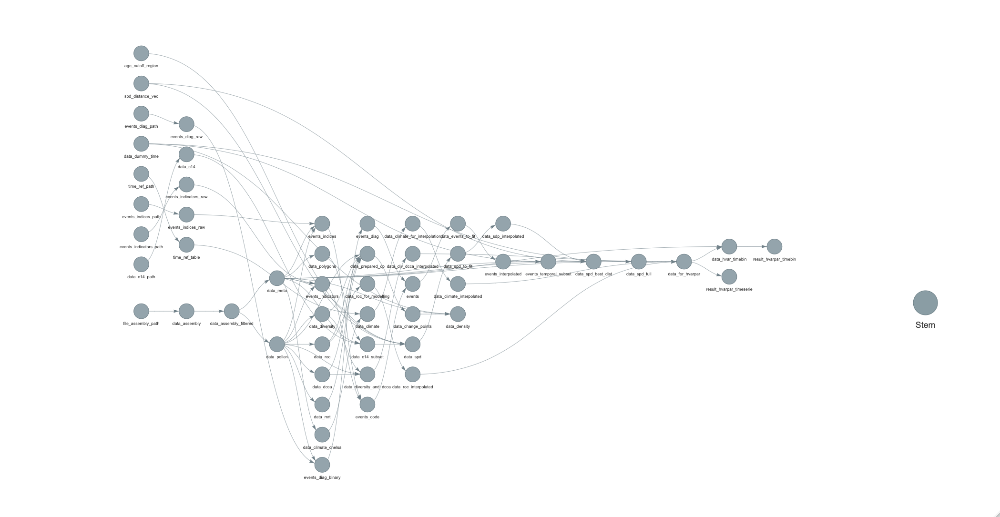

### Preface

The main scope of this report is to give you a detailed overview of the data input, data process, and analyses that has been done to find out if human activity have changed fundamental ecological processes over time (Hypothesis 1 in the HOPE project).

The report contain the workflow of methodological steps, description, and results. The complexity of the data processing prior to the main analyses makes it difficult to present orally without authors having relatively good understanding of the workflow, to be able to give (critical) comments (as to if major changes are needed). The hope is that this then will make the foundation of the methodology and result part of a manuscript.

The next step is to write a manuscript, but before we start it would be good to know what kind of involvement you would like to have, if you prefer to write certain sections etc. It is all open for suggestions and feedback. A meeting will be schedule to discuss these matters.

Things that would be good to make clear for everyone involved:

1.  Authorship:

    -   Authorships
    -   Data contributors

2.  Target journal -> important to decide now as to how to structure a manuscript 

3.  Interesting highlights of our results - the main story

4.  Feedback and comments to the methodology? Major changes needed?

5.  Progress plan

(Disclaimer: Many of the images and figures are quickly made, or older figures/images are included for help in visualising variables for the sake of completeness of the report (for HOPE members), I did not focus on good scientific writing either because that takes too much time for me at this stage, so please do not share this beyond the group).

# Part I: Methodology

## Main data aquisition

### FOSSILPOL

Aquiring the main pollen data for our analyses is done a priori. Raw pollen datasets are carefully selected using the *R-Fossilpol* package and the guidelines to the workflow are well described in Flantua et al. 2023 and our website [Fossilpol project](https://hope-uib-bio.github.io/FOSSILPOL-website/about.html). Most of the compilation of datasets are available through the [Neotoma Paleoecology Database](https://www.neotomadb.org). Though some additional datasets are from private owners in regions with lacking data, and these have restricted access for use. We do not have the intellectual property rights to make them public available. Only the derivative of the analyses will be possible to share openly. Table 1 provide the overview of the the settings used in the FOSSILPOL workflow to get the standardised datasets for this project.

```{r echo = FALSE, warning = FALSE, message = FALSE}


library(kableExtra)
library(tidyverse)
library(usethis)
library(targets)
library(here)
library(colorspace)
library(colorBlindness)
library(data.tree)

# list R functions and source them
lapply(
  list.files(
    path = here::here("R/functions"),
    pattern = "*.R",
    recursive = TRUE,
    full.names = TRUE
  ),
  source
) %>%
  invisible()

auth_tibble <-
  tibble::tibble(
    name = c("ondre", "omo084", "vfe032", "vfe032", "sfl046", "kbh022"),
    paths = c(
      "C:/Users/ondre/OneDrive - University of Bergen/HOPE_data/",
      "C:/Users/omo084/OneDrive - University of Bergen/HOPE_data/",
      "/Users/vfe032/Library/CloudStorage/OneDrive-SharedLibraries-UniversityofBergen/Ondrej Mottl - HOPE_data/",
      "C:/Users/vfe032/OneDrive - University of Bergen/HOPE_data/",
      "C:/Users/sfl046/University of Bergen/Ondrej Mottl - HOPE_data/",
      "C:/Users/kbh022/University of Bergen/Ondrej Mottl - HOPE_data/"
    )
  )

sys_info <- Sys.info()

username <-
  sys_info["user"]

data_storage_path <-
  auth_tibble %>%
  dplyr::filter(name == username) %>%
  purrr::pluck("paths")

if (length(data_storage_path) > 1) {
  data_storage_path <- data_storage_path[1]
}

external_storage_targets <-
  paste0(
    data_storage_path,
    "HOPE_Hypothesis1/_targets"
  )

# set configuration for _target storage
tar_config_set(
  store = external_storage_targets
)


min_age <- 0
max_age <- 12e3
timestep <- 500

# set colours 
#colours <- protan(rainbow_hcl(5, start = 30, end = 300))
#scale_fill_manual(values=colours) 

#scale_fill_hue(c = 50, l = 70, h=c(30, 300)) # light
#scale_fill_hue(c = 50, l = 50, h=c(30, 200)) # dark

```

```{r echo = FALSE}
file_path <- paste0(data_storage_path, "HOPE_Hypothesis1/Data/assembly/data_assembly-2022-05-23.rds")

data_settings <- get_file_from_path(file_path) %>% 
  pluck("setting")
```

```{r echo = FALSE, warning = FALSE, message = FALSE}

options(knitr.table.format = "html") 

tab_gen <- data_settings$general %>% 
  unlist %>% 
  as.data.frame() %>%
  rownames_to_column("Setting type") %>%
  rename(Selection = ".") 

tab_neo <- data_settings$Neotoma %>%
  unlist %>% 
  as.data.frame() %>%
  rownames_to_column("Setting type") %>%
  rename(Selection = ".") %>%
  filter(!grepl("chron_order.order", `Setting type`))

tab_age <- data_settings$age_depth_models %>%
  unlist %>% 
  as.data.frame() %>%
  rownames_to_column("Setting type") %>%
  rename(Selection = ".") 

tab_site <- data_settings$site_filtering %>%
  unlist %>% 
  as.data.frame() %>%
  rownames_to_column("Setting type") %>%
  rename(Selection = ".") 

overview_table <- tab_gen %>% 
  mutate(Selection = as.character(Selection)) %>%
  full_join(tab_neo) %>%
  full_join(tab_age %>% 
              mutate(Selection = as.character(Selection))) %>%
  full_join(tab_site %>% 
              mutate(Selection = as.character(Selection))) %>%
  mutate(Selection = ifelse(Selection == 1, TRUE, Selection))

overview_table %>%
  kbl(booktabs = TRUE, caption = "Table 1: Selection of settings applied in FOSSILPOL") %>%
  kable_paper(full_width = FALSE)  %>%
  kableExtra::pack_rows("General", 1, 7) %>%
  kableExtra::pack_rows("Neotoma", 8, 15) %>%
  kableExtra::pack_rows("Age-depth\n models", 16, 24) %>%
  kableExtra::pack_rows("Site filtering", 25, 36)

```

### Harmonisation tables

An important step in FOSSILPOL to get the standardisation of pollen records within and across regions is harmonisation of pollen types. There are different analyst with different schools and background, and the nomenclature can vary widely. To be able to make numerical comparisons across different pollen records, the level of pollen taxonomy should be similar. As a result, pollen harmonisation tables are produced for different regions, attempting to minimise biases related to this. The regional harmonisation tables used in our project are for Europe, Levant, Siberia, Southern Asia, Northern America, Latin America, Africa, and the Indo-Pacific region (Birks et al. harmonisation paper). These tables can be downloaded from (xxx), and are used as additional input in the Fossilpol workflow above ([see Fossilpol step_by_step guide](https://hope-uib-bio.github.io/FOSSILPOL-website/step_by_step_guide.html)).

## Workflow for HOPE Hypothesis 1

We use the [targets](https://books.ropensci.org/targets/) package in R to produce a reproducible workflow for all data processing, analyses, and visulisation of the results from this project. For this we created a data analysis project called [HOPE_hypothesis1 in Github](https://github.com/HOPE-UIB-BIO/HOPE_Hypothesis1). This contain all data, metadata, and R functions needed to run this project, and it provides full transparency in all steps from data input, data processing, statistical analysis, and the derived results.

Our output of targets is set up with in an external storage at OneDrive where we save the main targets folder with data and meta data, while the target script and functions are saved in our Github project. Note that first time running targets without access to our main data folder will take time. The targets are split up in many steps with several specialised functions that is made to loading necessary data, to get estimates of various variables or structuring various subsets of data step wise. This is to avoid the need for re-running major parts that take too long when the data is already processed. There is a dependency in the list of targets that the in the end to run the final analyses, all other targets need to be up-to-date. Targets will detect any changes made in the functions, if this happens the targets will automatically rerun the parts that are dependent on this change, but at the same time skip all the parts that are up-to-date.

The file structure in Github is
```{r echo = FALSE, warning = FALSE, message = FALSE}
# create paths
path <- c(
  "HOPE_Hypothesis1/",
  "HOPE_Hypothesis1/___Init_project___.R",
  "HOPE_Hypothesis1/_targets.R",
  "HOPE_Hypothesis1/_targets_packages.R",
  "HOPE_Hypothesis1/HOPE_Hypothesis1.Rproj",
  "HOPE_Hypothesis1/R/",
  "HOPE_Hypothesis1/renv/",
  "HOPE_Hypothesis1/R/functions/",
  "HOPE_Hypothesis1/R/functions/climate/",
  "HOPE_Hypothesis1/R/functions/data_wrangling/",
  "HOPE_Hypothesis1/R/functions/events/",
  "HOPE_Hypothesis1/R/functions/hvarpart/",
  "HOPE_Hypothesis1/R/functions/modelling/",
  "HOPE_Hypothesis1/R/functions/PAPs/",
  "HOPE_Hypothesis1/R/functions/spd/",
  "HOPE_Hypothesis1/R/functions/visualisation/"
  )
  

(filetree <- data.tree::as.Node(data.frame(pathString = path)))

```

All that is needed when the project is set up, is to run the scripts `___init_project.R___` and `_targets.R`. This install and load all the packages that is needed and functions that have been created to run the targets or tasks for this project. The functions are divided into different folders to make it easier to find the functions for subtasks instead of collecting them in one script. The functions are specialised wrapper functions for our data structure, but they depend on costume made functions that are gathered in the `R-Ecopol` package. The figure below show the network of targets. 




The targets are arranged in a order to prepare all the data needed for the main analysis in the end. First, it is setting the options for data interpolation to get all samples on equal time spacing, loading the FOSSILPOL dataset, creating dummy tables and variables needed for input in the specialised functions to process data. This is followed by the data processing steps for each of the explanatory and response variables that is needed in this project. The largest pre-processing of data starts with preparation of the explanatory variable detecting past human presence and impact. This is a major analyses in itself. This follows by data extraction of palaeo-climate from the CHELSA paleoclimate database. This is modeled palaeo-climate data for each of the geographical location of the pollen records. First time the function is run, it will download the data from a URL connection, and extract data for the climatic variables selected, and deleted the data that is not needed to save storage in local computer. It is followed by different targets that process all estimates of the response variables selected to get measures of pollen assemblage properties. In general, all data such as raw estimates and interpolated data are kept to allow careful checking and validation of output. In the end, data is structure to fit the main analysis. This analysis is divided into two parts which we call the 1) the spatial (within core) analysis, and 2) the temporal analysis (a *spatial* or between core/sample analysis per timestep ca. every 500 years). Several choices are made, which are described in the detail in the text below.

### Data filtering

The main data are divided into `data_assembly` which store all the pollen records and chronologies, and `data_meta` which contain the general site information. An extra data filtering step is done on the `data_assembly` to get as high data quality as possible to be able compare the numerical estimates on standardised datasets. These extra filtering criterias are removing potentially duplicated pollen records, sorting levels (samples) by ages, filtering out levels (samples) based on a threshold of total number pollen grains counted (= pollen sum), filtering out sequences (pollen records) based on age limits (minimum and maximum age ranges), filtering out levels (samples) by the last control point, filtering out samples beyond the age limits of interest, and filtering out pollen records based on the total number of samples (N).

This filtering is done on the chronologies , raw pollen counts, harmonised pollen counts, and the age uncertainties related to the chronologies. The preferable number of minimum pollen grains is set to 150, but this led to a great loss of datasets in regions with less data coverage, and we therefore reduced this number to 25, if less than 50 % of the samples had a low count, as low pollen sum can be due to varying pollen concentrations in different parts of a sequence. This allow us to keep more datasets, but in these cases the pollen records have a low pollen sum, we acknowledge that the estimates of pollen assemblage properties (PAPs) are less robust (check/report how many cases..). The maximum age beyond extrapolation is set to 3000 years. Ages extrapolated beyond this threshold is considered highly uncertain. Also all pollen records with less than 5 samples are removed for further analyses. The data used further in our project is called the `data_assembly_filtered`.

### Detection of past human presence

In order to detect the impact of past humans on fundamental ecosystem properties we needed to develop indicators of past human presence and activity. This led to the development of a new approach where we use detection of human events identified from pollen records based on expert knowledge, in combination with the methodology of quantifying presence of humans based on radiocarbon dates from archaeological artefacts and Summed Probability Densities (SPD) (Bird et al. 2022). In our view this solved some issues where we can use one standardised variable as an indicator of past human impact, and partly avoid the difficulties of creating standardised variables for detecting human disturbance events in different regions and across continent, and reduce the circularity of detecting human events on the same pollen records as the estimates of ecosystem properties. 

.


#### *Detection of human events*

For each pollen record, we have detected periods of human events from the pollen data. Two methods have been used: i) detection from pollen diagrams (North America, Europe, Asia, Indopacific; ii) detection using indicator taxa (Latin America).

#### *Detection from pollen diagrams*

First, a pollen diagram of each pollen record has been examined by a regional expert and the age of each event type has been recorded.

Add more text about how the event types have been defined.....

```{r echo = FALSE, warning = FALSE, message = FALSE}

event_table <- data.frame(Region = c("North America", "Europe", "Asia", "Indopasific"), 
                          `Event-type` = c(
                            paste("BI = Before Impact; FC = First Cultivation; ES = European Settlement"),
                            paste("BI = Before Impact; FI = First Indication; FCu = First Cultivation; EC = Extensive Clearance; CC = Complete Clearance"),
                            paste("BI = Before Impact; FI = First Indication; FCu = First Cultivation; EI = Extensive Impact"),
                            paste("no_impact = No Impact; weak = Weak Impact; medium = Medium Impact; strong = Strong Impact")))

event_table %>%
  kbl(booktabs = TRUE, caption = "Table 2: Type of human events identified in pollen diagrams") %>%
  kable_paper(full_width = FALSE)


```

Note that the event types are uniquely defined within continents, and event types with the same name have different meanings between continents.

Second, an algorithm is made to get the binary variables (0/1) per event type identified in each pollen record. A new vector with values of average ages in between levels (samples) of the identified event type was created, then a matrix of 'age vector x event types' were made with binary value (0/1) assign to each value depending on the age of the event type (the event type is present (1) if age \> detected age). Finally, logical rules were applied and the binary values were adjusted for each region to get the event data for each pollen record. If there is no human event identified, it does not mean humans were absent, but that is was not possible to identify human activity from the pollen records. 

Below is a summary figure for the events aggregated within different regions and ecozones using the raw event data. The different colouring display the event types with each region. The lines represent a simple binomial GAM model only for visualising the main trends of changes in different human events identified in the pollen diagrams over time in each region. The raw data is the 0/1 dots.   

```{r echo = FALSE, warning = FALSE, message = FALSE}

data_events <- targets::tar_read(data_events_to_fit)


plot_data_events(
  data_source_events = data_events,
  select_region = "Europe"
)

plot_data_events(
  data_source_events = data_events, 
  select_region = "North America"
  )

plot_data_events(
  data_source_events = data_events,
  select_region = "Asia"
)

plot_data_events(
  data_source_events = data_events,
  select_region = "Oceania"
)


```

In North America, Asia, and Oceania there is an extra panel entitled `NA`. It contains a few datasets in these regions, most likely because they have not the geographical location within a defined ecozone in the shapefile in FOSSILPOL. In addition, Oceania contains also the var_name of the events type identified for Asia. This might be because some of the sites in Asia have been reassigned to the region Oceania.  


#### *Detection using indicator taxa*

An extensive literature review has been done to detect fossil pollen taxa that can be associated with human activity (Add the two tables of groups of indictors and single indictors?). The aggregation of indicator groups vary across the continent, both between regions and countries, and the combination of indicator groups for pollen records within the area of expertise. An algorithm has been made to assess each pollen records, which goes through the presence of taxa in combinations of the recorded indicator groups, and detect if the signal of pollen indicator is based on a defined threshold.

(Add tables with scrollbars here?)


Two categories were created: i) 'human event indicators': a single taxa associated with human activity classified as 'weak' or 'strong' impact; ii) 'human event indices': a combination of particular taxon is classified as 'weak' or 'strong' impact. For each level of each pollen record, all indicators and indices were tested for its presence in the level and whole level we classified as "no impact", "weak impact" or "strong impact" (disregard of the source of the classification). Specifically, at least 1 pollen grain of indicators have to present as 'weak' and more than 1 has to present as 'strong'. In addition, the pollen-type *Pinus* was only considered as a human indicator outside of its native distribution (see XXX?). For indices, any number of pollen grain needs to present for that specific combination.

Summary figure of the events using indicator taxa in different ecozones in Latin America:
```{r echo = FALSE, warning = FALSE, message = FALSE}

data_events <- targets::tar_read(data_events_to_fit)

plot_data_events(
  data_source_events = data_events,
  select_region = "Latin America"
)

```


#### *Arcehological artefacts and Summed Probability Densities*

We used the global dataset of radicarbon dates (RC dates) of archeological artefacts from Bird et al 2022. The quantification of SPD require a distance to be selected around each site location to collect the relevant dates of archaeological artefacts around it. This will limit the area of human presence and indirectly the amount of human activity relevant to pollen records from each site.

Only RC dates with valid geographical location (longitude and latitude), and 'LocAccuracy' \> 0 were filtered out as the first step. For each pollen record, RC dates were classified by the geographical distance to the pollen record. The chosen distance classes were: 5, 25, 50, 100, 250, 500 km.

For each pollen record, one variable of SPD´s in time was calculated for each distance class (see above). Radiocarbon dates were calibrated using `calibrate` function from `rcarbon` package with apropriate calibration curves ("IntCal20", "ShCal20", "mixed"). Calibration curves were obtained `rcarbon` package and "mixed" was created using `rcarbon::mixCurves` function with 'p' = 0.5. Calibration curves were assigned by their geographical location following Hua et al., 2013.

SPD is estimated using `spd` function from `rcarbon` package for each distance class for each year between a minimum threshold age and 12 ka. However, distance class with less than 50 RC dates is filtered out in order to maintain robust SPD estimation. The minimum threshold ages are different for different regions and are decided based on the availability of radiocarbon dating for different regions. In general there is a bias that radiocarbon dating is rather limited on younger material.

```{r echo = FALSE, warning = FALSE, message = FALSE}

age_cutoff_rc <- data.frame(
    region = c("Europe", "Latin America", "Asia", "Africa", "North America", "Oceania"),
    age_from = c(2000, 2000, 2000, 2000, 500, 500)
  )

age_cutoff_rc %>%
  kbl(booktabs = TRUE, caption = "Table 3: Minimum threshold age for different regions") %>%
  kable_paper(full_width = FALSE) 

```


In order to select distance from each pollen record, which will limit the area of human activity relevant to that pollen record, we used an expert-based detection of human events from pollen records to inform the estimation of SPD.

For each distance class of SPD of each pollen record, one Redundancy Analysis (RDA) is estimated using `vegan::rda` function for with event types as responses (binary) and SPD values as predictors. Next, R2 is estimated using `vegan::RsquareAdj` function for each distance class. Finally, the distance class with the highest R2 is selected as the representation of human presence, and indirectly human activity, for that pollen record.

This approach is not perfect and it is neglecting topographic differences and presence of water bodies. However, this was selected as a balance between simplicity and generality, and to avoid unnecessary increase of complexity in choosing the distance from the sites. See demonstration of this method [Detection of past humans](https://github.com/HOPE-UIB-BIO/HOPE_Archaeo_C14/blob/master/R/07_Methodology%20example.md).

Summary figure of SPDs in time for different regions and ecozones:

```{r echo = FALSE, warning = FALSE, message = FALSE}

data_to_spd_plot <- tar_read(data_spd_full) %>%
  inner_join(targets::tar_read(data_meta) %>%
                           dplyr::select(dataset_id, 
                                         region, 
                                         ecozone_koppen_5), 
                       by = "dataset_id") %>%
  dplyr::select(dataset_id, spd, region, ecozone_koppen_5) %>%
  unnest(spd) %>%
  filter(!is.na(spd))

data_to_spd_plot %>%
  ggplot(aes(x = age, y = spd, col = ecozone_koppen_5)) +
  geom_point() +
  scale_colour_hue(c = 50, l = 50, h = c(30, 300)) +  
  geom_smooth() +
  facet_wrap(~region, scales = "free") +
  theme_classic() +
  theme(legend.position = "bottom") 

```

As you can see from the figure of the different regions, we have no data for past human influence in Africa, so for the main analyses, this region has been filtered out. 


### Paleo Climate

Paleoclimate from the CHELSA-TraCE21k downscaling algorithm is downloaded from the [CHELSA database](https://chelsa-climate.org/paleo-climate/) (Karger et al. 2021, Karger et al. 2021). The selected bioclimatic variables are annual mean temperatures ℃ (bio1), minimum temperatures of coldest month ℃ (bio6), annual precipitation kg m-2 year-1 (bio12), precipitation seasonality (bio15), precipitation of warmest quarter kg m-2 quarter-1 (bio18) and precipitation of coldest quarter kg m-2 quarter-1 (bio19), where we extracted climate values for the coordinates for each dataset_id retrieving the full time series of every 100 years. In addition, we downloaded the monthly climatology for daily maximum near-surface temperature K/10 (tasmin). 

### Pollen assemblage properties (PAP) estimation

To prepare the response variables of our main pollen dataset and to be able to analyse vegetation changes in time due to fundamental ecosystem properties, we prepared the standard estimates of pollen assemblage properties (PAP) (Bhatta et al. 2023). The PAP estimations provide different aspects of pollen assemblage diversity which includes palynological richness, diversity and evenness, compositional change and turnover, and Rate-of-Change (RoC).

These response variables are calculated using the newly developed [R-Ecopol package](https://github.com/HOPE-UIB-BIO/R-Ecopol-package) that contain all the functions needed to estimate PAPs for our pollen data assembly. The base functions used in this package are derived from other dependency packages such as `mvpart` package (Therneau et al. 2014) to estimate pollen zonations with multivariate regression trees, `vegan` (Oksanen et al. 2022) for other mutivariate techniques and dissimilarity indices, `R-Ratepol` (Mottl 2021) to get the estimates of RoC, functions from `iNext` (Chao et al. 2014) that have been modified to extract interpolated Hill numbers based on a minimum sample size, and newly developed R functions to run DCCA using `Canoco 4.5` (ter Braak xxxx) to list a few, among other, dependency packages.

#### *Pollen richness, diversity, and evenness*

The different aspects of palynological diversity are estimated using Hill´s effective species numbers N0, N1, N2, and the associated evenness ratios of N2/N1 and N1/N0. These are combined through one equation where the effective species numbers differ mainly in how the rare taxa are weighted in the parameter q:

$$^q{D} = (\sum_{i=1}^{S} p_{i}^{q})^{1/(1-q)}$$

When q is 0, rare and abundant taxa have equal weight and the number is simply the number of taxa in the sample. The equation is not possible to define for q = 1, but as it approaches 1, it is equal to the exponential of the well-known Shannon index and reports the number of equally common taxa. When q = 2, it is the same as the inverse Simpson diversity index and provides the number of equally abundant taxa with a low weight on rare taxa. The advantage of using effective species numbers is that they provide easily interpretable units and contain the doubling effect. To standardize the sample sizes, we use the rarefaction approach developed by Chao et al. These estimates are rarefied to the number of n = 150 grains, or in some cases to a lower sum (minimum n = 25). Some pollen records were only available as pollen percentages, and as the sample size is unknown, these are then rarefied to the minimum sum of percentages. The evenness ratios will be 1 if all taxa are equally abundant, and the ratios hence indicate changes in abundances between the numbers of rare, equally common, and abundant taxa.

We acknowledge that even though attempts are made to standardise richness and diversity estimates based on standard sample size, there are additional biases that are not taken into consideration such as differences in total pollen production and pollen representation (Odgaard 1998, 2001). In some cases, the total pollen sum is also too low to be considered a robust estimate, but it was a choice made on balancing loosing too much information from geographical areas with less data coverage (see data filtering above).

#### *Compositional change*

Compositional change is calculated using multivariate regression trees (MRT) with age as the constraining variable. MRT is in general a robust tool to explore and predict changes in multivariate data sets using environmental predictor variables (De´ath, Simpson and Birks 2012). This technique has been adopted in palaeoecology to detect major zones in pollen diagrams or shifts between periods of homogeneous vegetation in time (Simpson and Birks 2012). We use the pollen taxa in percentages without any data transformations as the response and the median ages derived from the age-depth model as the constraining variable. The recursive partitioning are based on chi-square distances between pollen samples constrained by time. The number of cross-validation is set to 1000, and the optimal sized tree is chosen based on the 1SD rule (Simpson and Birks 2012).

#### *Compositional turnover*

Compositional turnover is estimated using detrended canonical correspondence analysis (DCCA) with age as the explanatory variable (ter Braak and Smilauer 2007?). Changes in Weighted average (WA) sample scores (CaseR scores sensu ter Braak and Smilauer 2012) are measures of compositional turnover in standard deviation (SD) units (Birks 2007). The WA scores are regressed with time using a second-order polynomial (age+age\^2) to allow more flexibility in the turnover pattern within a pollen record. Total compositional turnover is a measure of the total length of CaseR scores along the DCCA axis 1, whereas the pattern within a record is the measures between the individual samples along the DCCA axis 1. The response data are pollen percentages without any transformation to maintain the chi-square distances between samples, whereas the ages are the median ages derived from the age-depth model for each site.

#### *Rate-of-change*

Rate-of-change for the pollen assemblages in the pollen records are quantified using the novel [R-Ratepol package](https://github.com/HOPE-UIB-BIO/R-Ratepol-package) (Mottl et al. 2021). RoC is estimated using moving windows of 500 years´time bins of five number of windows shifts where samples are randomly selected for each bin. This approach is shown to increase the correct detection of RoC peak-points than the more traditional approaches (Mottle et al. 2021). RoC are reported as dissimilarity per 500 years using the Chord dissimilarity coefficient. Sample size is standardized in each working unit to 150 grains or the lowest number detected in each dataset. We use only the RoC scores further in the analyses.

#### *Change-points detection and density estimates*

Change-points detection of all the PAP variables are calculated using conventional regression trees (RT) for single variables with Euclidean distances. An algorithm is made to detect the transitions between the resulting groups (or zones) per variable, and these are coded as new binary (0/1) variables. A change-point is defined as 1, where the mean ages between the two consecutive samples are used as the timing of this significant change. This is done individually for each PAP variable.

The density is calculated for each of these variables using a Gaussian kernel, re-scaling them to each of the records specific age ranges (i.e. minimum and maximum ages). To solve the boundary issue in density estimation the data is reflected to 0. Hierarchical generalised additive models (HGAM) are then used to produce two different fitted variables where the first density get the common pattern of the density estimates of all the variables reflecting significant changes in richness, diversity, and evenness, and the second variable get the common pattern of the densities of the variables reflecting significant change in pollen assemblages (MRT, RoC, DCCA1).

Example of ten sites and PAP estimations:


### Hierarchical variation partitioning

All response variables, except the two fitted diversity and compositional density variables, have been estimated using the harmonised pollen counts, and then the raw estimates have been linearly interpolated to get the data points on equal time spacing of 500 years. Equal time spacing is necessary for the second temporal-spatial analysis (below). Comparison of interpolation methods using either linear or generalised additive models (GAMs) showed that linear interpolations resulted in correlations between the response variables that are more similar to the correlations between the variables of the raw estimates of data. The univariate GAM models could show unexpected patterns in single variables that changed these multivariate correlations. Since we cannot individually assess single GAM models for each variable for all the sites, we choose the simplest interpolation method to keep the data as close as possible to the raw estimates before using them in the multivariate models.  In addition, we remove Africa as a region, because as you can see from section about *past human detection* above, we do not have any data of *past human presence*.

To test if ecological processes have changed due to past human activity within cores, we use reduced rank multivariate regression. This is also known as distance-based redundancy analysis (db-RDA). We used the R package `rdacca.hp` to run hierarchial variation partitioning with several predictors. This estimate the variation per variables in different combinations to get the average variable importance independent of the order of predictors. db-RDA was performed using *Gower-distances* adding a constant because we are dealing with a mix of numerical responses variables. These are the different PAPs with varying units. Depending on the type of analyses (see below), the explanatory variables are SPDs and palaeoclimatic variables. For within core analysis (see below) we also include time as an explanatory variable. SPD is then the important variable of main interest as it represent past human presence. The palaeoclimate is a matrix of summer precipitation, winter precipitation, annual temperatures and winter temperatures. These are selected as we considered them most relevant to represent differences in climatic conditions within all the regions (regarding temperatures, seasonality and aridity). Time is represented by the ages of each pollen record, however, this is more difficult to interpret. We assume age may represent time dependent vegetation changes such as natural successions and/or ecological changes due to interaction between taxa. 


To do this, we have coded two functions one generalised called `get_varhp` and a specialised function that perform the analysis on our dataset called `run_hvar`. The parameters `data_source` is a combined pre-structure `tibble` that take the data stored in the `data_merge` column. This contain all preprepared variables for each dataset that will be input into the analysis. Because this contain all variables, there are two parameters  `response_vars` and `predictor_vars` where you can select the variables you want to include as responses and predictors in the hierarchical variation partitioning analysis. The predictor variables can be applied either as individual predictors or as groups as predictors. In our case, we run the analysis with *groups of predictors*. This means that the palaeoclimatic variables are included as one matrix and not assessed as individual predictors. (Though the overall results does not change much). The advantage using palaeoclimate as single predictors is that it is possible to get which of climatic variables are important (high adj R2) or statistically significant, if significant testing is turned on. Statistical testing can be applied in two ways, both which shuffle the predictor variables. Using `time_series` set as TRUE, statistical testing is run with restricted Monte Carlo permutation for time series analysis (sensu ter Braak XXXX) which has a cyclic behavior of samples to keep the stratigraphical order intact. If `time_series` is set as FALSE, predictor variables will be randomly shuffled as many times set in the parameter `permutations` (hence it use the default permutation in the `rdcca.hp` package). 

The analysis is run in two different ways to analyse: - 1) to analyse *spatial changes* which run the hierarchical variation partitioning within single cores or site, and - 2) to analyse the *temporal patterns* in space for each of the 500 year time steps. In this latter analysis, we restructure the data as samples across space within selected Koppen-Geiger division of five major ecozones on each continent, whereas the analysis is run per time bin. The predictor groups are past human presence and the matrix of palaeoclimatic variables. For this, we filter out time bins which have less than 5 samples. For some bins, if all the spds equal zero, the analysis will fail. These cases indicate insufficient numbers of predictors and will return NA for these specific time bins.

# Part II: Results

Figure 1 - the general distribution of sites and summary of number of sites per region and ecozones


### Summary results for the spatial changes (within core analysis)


Figure 2 - violin plots of total explained variation per region across ecozones
Figure 3 - pie charts of uniely percentage explained variation of total constrained  
Figure 3 - uniquely explained variation of past human impact across the world - maps
Figure 4 -


