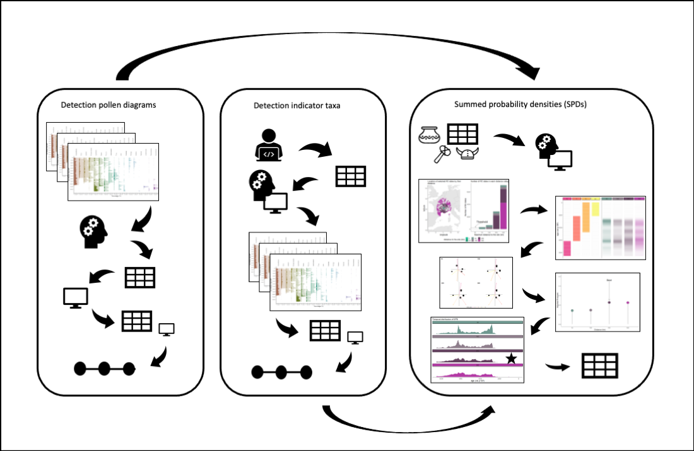
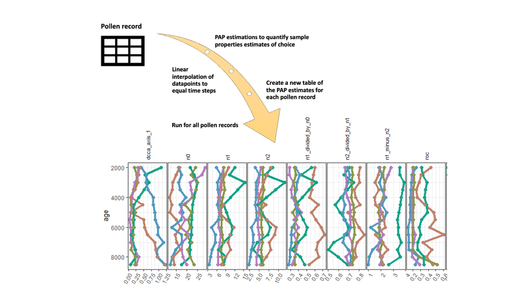
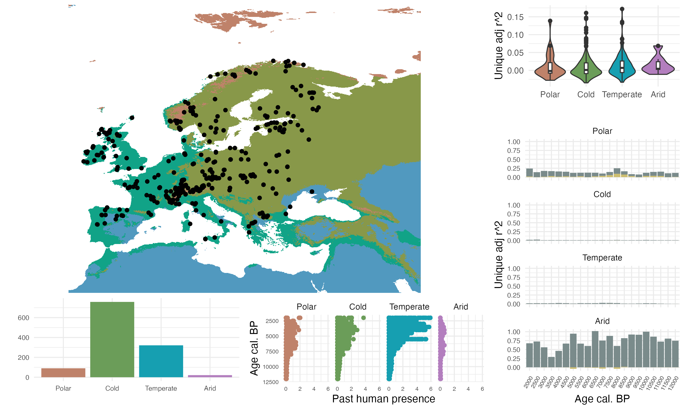
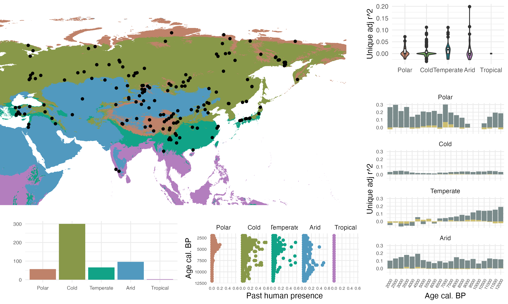
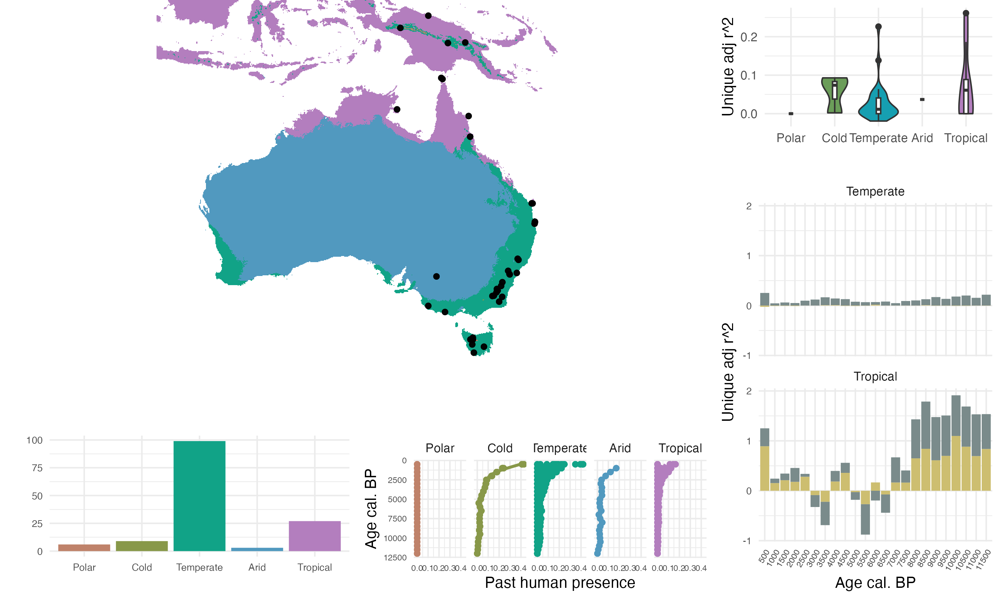

### Preface

The main scope of this report is to give you a detailed overview of the
data input, data process, and analyses that has been done to find out if
human activity have changed fundamental ecological processes over time
(Hypothesis 1 in the HOPE project).

The report contain the workflow of methodological steps, description,
and preliminary results. Without the co-authors having relatively good
understanding of the workflow it would be challenging to grasp the data
processing during a presentation and to be able to give (critical)
comments (as to if major changes are needed). The hope is that this
report provides you the basic understanding of the methodologies
applied, and parts of it can be used for the manuscript.

The next step is to write a manuscript, but before we start drafting, it
would be good to know what kind of involvement you would like to have,
e.g. if you´d like to lead certain sections etc. It is all open for
suggestions and feedback. A meeting will be scheduled to discuss these
matters.

Things that we need to decide on now:

1.  Authorship:

    -   Authorships
    -   Data contributors

2.  Target journal -\> important to decide now as to how to structure a
    manuscript

3.  Interesting highlights of our results - the main story

4.  Feedback and comments to the methodology? Major changes needed?

5.  Progress plan

(Disclaimer: Many of the images and figures are quickly made, or older
figures/images are included for help in visualising variables for the
sake of completeness of the report (for HOPE members), I did not focus
on good scientific writing either because that takes too much time for
me at this stage, so please do not share this beyond the group).

# Part I: Methodology

## Main data aquisition

### FOSSILPOL

Acquiring the main pollen dataset compilation for our analyses is done a
priori. Raw pollen datasets are carefully selected using the
*R-Fossilpol* package and the guidelines to the workflow are well
described in Flantua et al. 2023 and our website [Fossilpol
project](https://hope-uib-bio.github.io/FOSSILPOL-website/about.html).
Most of the compilation of datasets are available through the [Neotoma
Paleoecology Database](https://www.neotomadb.org). Some additional
datasets are from private owners in regions with lacking data, and these
have restricted access for use. We do not have the intellectual property
rights to make them public available. Therefore, only the derivatives of
the analyses will be possible to share openly. Table 1 provides the
overview of the the settings used in the FOSSILPOL workflow to get the
standardised datasets for this project.

### Harmonisation tables

An important step in FOSSILPOL to obtain a standardised pollen dataset
within and across regions is harmonisation of pollen types. There are
different analysts with different schools and background, and the
nomenclature can vary widely. To be able to make numerical comparisons
across different pollen records, the level of pollen taxonomy should be
similar. As a result, pollen harmonisation tables are produced for
different regions, attempting to minimise biases related to this. The
regional harmonisation tables used in our project are for Europe,
Levant, Siberia, Southern Asia, Northern America, Latin America, Africa,
and the Indo-Pacific region (Birks et al. harmonisation paper). These
tables can be downloaded from (xxx), and are used as input in the
Fossilpol workflow above ([see Fossilpol step_by_step
guide](https://hope-uib-bio.github.io/FOSSILPOL-website/step_by_step_guide.html)).

```{r echo = FALSE, warning = FALSE, message = FALSE}

#library(kableExtra)
library(tidyverse)
library(usethis)
library(targets)
library(here)
library(colorspace)
library(colorBlindness)
library(data.tree)

# list R functions and source them
lapply(
  list.files(
    path = here::here("R/functions"),
    pattern = "*.R",
    recursive = TRUE,
    full.names = TRUE
  ),
  source
) %>%
  invisible()

auth_tibble <-
  tibble::tibble(
    name = c("ondre", "omo084", "vfe032", "vfe032", "sfl046", "kbh022"),
    paths = c(
      "C:/Users/ondre/OneDrive - University of Bergen/HOPE_data/",
      "C:/Users/omo084/OneDrive - University of Bergen/HOPE_data/",
      "/Users/vfe032/Library/CloudStorage/OneDrive-SharedLibraries-UniversityofBergen/Ondrej Mottl - HOPE_data/",
      "C:/Users/vfe032/OneDrive - University of Bergen/HOPE_data/",
      "C:/Users/sfl046/University of Bergen/Ondrej Mottl - HOPE_data/",
      "C:/Users/kbh022/University of Bergen/Ondrej Mottl - HOPE_data/"
    )
  )

sys_info <- Sys.info()

username <-
  sys_info["user"]

data_storage_path <-
  auth_tibble %>%
  dplyr::filter(name == username) %>%
  purrr::pluck("paths")

if (length(data_storage_path) > 1) {
  data_storage_path <- data_storage_path[1]
}

external_storage_targets <-
  paste0(
    data_storage_path,
    "HOPE_Hypothesis1/_targets"
  )

# set configuration for _target storage
tar_config_set(
  store = external_storage_targets
)


min_age <- 0
max_age <- 12e3
timestep <- 500

# set colours 
#colours <- protan(rainbow_hcl(5, start = 30, end = 300))
#scale_fill_manual(values=colours) 

#scale_fill_hue(c = 50, l = 70, h=c(30, 300)) # light
#scale_fill_hue(c = 50, l = 50, h=c(30, 200)) # dark

```

```{r echo = FALSE}
file_path <- paste0(data_storage_path, "HOPE_Hypothesis1/Data/assembly/data_assembly-2022-05-23.rds")

data_settings <- get_file_from_path(file_path) %>% 
  pluck("setting")
```

```{r echo = FALSE, warning = FALSE, message = FALSE}

options(knitr.table.format = "html") 

tab_gen <- data_settings$general %>% 
  unlist %>% 
  as.data.frame() %>%
  rownames_to_column("Setting type") %>%
  rename(Selection = ".") 

tab_neo <- data_settings$Neotoma %>%
  unlist %>% 
  as.data.frame() %>%
  rownames_to_column("Setting type") %>%
  rename(Selection = ".") %>%
  filter(!grepl("chron_order.order", `Setting type`))

tab_age <- data_settings$age_depth_models %>%
  unlist %>% 
  as.data.frame() %>%
  rownames_to_column("Setting type") %>%
  rename(Selection = ".") 

tab_site <- data_settings$site_filtering %>%
  unlist %>% 
  as.data.frame() %>%
  rownames_to_column("Setting type") %>%
  rename(Selection = ".") 

overview_table <- tab_gen %>% 
  mutate(Selection = as.character(Selection)) %>%
  full_join(tab_neo) %>%
  full_join(tab_age %>% 
              mutate(Selection = as.character(Selection))) %>%
  full_join(tab_site %>% 
              mutate(Selection = as.character(Selection))) %>%
  mutate(Selection = ifelse(Selection == 1, TRUE, Selection))

overview_table %>%
  kbl(booktabs = TRUE, caption = "Table 1: Selection of settings applied in FOSSILPOL") %>%
  kable_paper(full_width = FALSE)  %>%
  kableExtra::pack_rows("General", 1, 7) %>%
  kableExtra::pack_rows("Neotoma", 8, 15) %>%
  kableExtra::pack_rows("Age-depth\n models", 16, 24) %>%
  kableExtra::pack_rows("Site filtering", 25, 36)

```

## Workflow for HOPE Hypothesis 1

We use the [targets](https://books.ropensci.org/targets/) R-package to
produce a reproducible workflow for all data processing, analyses, and
visualisation of the results from this project. For this we created a
Github repository with a data analysis R-project called
[HOPE_hypothesis1 in
Github](https://github.com/HOPE-UIB-BIO/HOPE_Hypothesis1) that contains
all data, metadata, and R functions needed to run this R-project.

Our output of targets is set up with in an external storage at UiB
OneDrive where we save the main targets folder with data and meta data,
while the targets script and functions are saved in our Github project.

In case anyone wants to run the workflow, note that first time running
targets without access to our main data folder will take time. The
targets are split up in many steps with several specialised functions
that is made to loading necessary data, to get estimates of various
variables or structuring various subsets of data step wise. This is to
avoid the need for re-running major parts that take too long when the
data is already processed. There is a dependency in the list of targets
that the in the end to run the final analyses, all other targets need to
be up-to-date. Targets will detect any changes made in the functions. In
such case, targets will automatically rerun the parts that are dependent
on this change, but at the same time skip all the parts that are
up-to-date.

The file structure in Github is

```{r echo = FALSE, warning = FALSE, message = FALSE}
# create paths
path <- c(
  "HOPE_Hypothesis1/",
  "HOPE_Hypothesis1/___Init_project___.R",
  "HOPE_Hypothesis1/_targets.R",
  "HOPE_Hypothesis1/_targets_packages.R",
  "HOPE_Hypothesis1/HOPE_Hypothesis1.Rproj",
  "HOPE_Hypothesis1/R/",
  "HOPE_Hypothesis1/renv/",
  "HOPE_Hypothesis1/R/functions/",
  "HOPE_Hypothesis1/R/functions/climate/",
  "HOPE_Hypothesis1/R/functions/data_wrangling/",
  "HOPE_Hypothesis1/R/functions/events/",
  "HOPE_Hypothesis1/R/functions/hvarpart/",
  "HOPE_Hypothesis1/R/functions/modelling/",
  "HOPE_Hypothesis1/R/functions/PAPs/",
  "HOPE_Hypothesis1/R/functions/spd/",
  "HOPE_Hypothesis1/R/functions/visualisation/"
  )
  

(filetree <- data.tree::as.Node(data.frame(pathString = path)))

```

All that is needed when the R-project is set up, is to run the scripts
`___init_project.R___` and `_targets.R`. This will install and load all
the packages that are needed.

Temporarily figure (need to make a conceptual figure to be set in here)


The targets are arranged in a order to prepare all the data needed for
the main analysis in the end. - 1) The first steps of the workflow
imports and load all data needed for the pre-processing data steps and
analyses such as the final HOPE dataset compilation and other input
tables e.g human event-types for different regions. - 2) This is
followed by data processing for each of the explanatory and response
variables in H1: --a) The largest pre-processing of data starts with
preparation of the explanatory variable detecting past human presence
and impact. This is a major analyses in itself. --b) This follows by
data extraction of palaeo-climate from the CHELSA paleoclimate database.
This is modeled palaeo-climate data for each of the geographical
location of the pollen records. First time the function is run, it will
download the data from a URL connection, and extract data for the
climatic variables selected, and deleted the data that is not needed to
save storage in local computer. --c) It is followed by different targets
that process all estimates of the response variables selected to get
measures of ecosystem properties. In general, all data such as raw
estimates and interpolated data are kept to allow careful checking and
validation of output. -3) In the end, data is structure to fit the main
analysis. This analysis is divided into two parts which we call the --a)
the spatial (within core) analysis, and --b) the temporal analysis (a
*spatial* or between core/sample analysis per timestep ca. every 500
years). Several choices are made, which are described in the detail in
the text below.

### Data filtering

The main data are divided into what is named `data_assembly`in targets
which store all the pollen records and chronologies, and what is named
the `data_meta` which contain the general site information. We applied a
set of filtering criteria to get as high data quality as possible to be
able compare the numerical estimates on standardised datasets. These
filtering criteria are: removing potentially duplicated pollen records,
sorting levels (samples) by ages, filtering out levels (samples) based
on a threshold of total number pollen grains counted (= pollen sum),
filtering out sequences (pollen records) based on age limits (minimum
and maximum age ranges), filtering out levels (samples) by the last
control point, filtering out samples beyond the age limits of interest,
and filtering out pollen records based on the total number of samples
(N).

This filtering is done on the chronologies, raw pollen counts,
harmonised pollen counts, and the age uncertainties related to the
chronologies. The preferable number of minimum pollen grains is set to
150, but this led to a great loss of datasets in regions with less data
coverage, and we therefore reduced this number to 25, if less than 50 %
of the samples had a low count, as low pollen sum can be due to varying
pollen concentrations in different parts of a record. This allow us to
keep more datasets, but in these cases the pollen records have a low
pollen sum, we acknowledge that the estimates of pollen assemblage
properties (PAPs) are less robust (PENDING: check/report how many
cases..). The maximum age beyond extrapolation is set to 3000 years.
Ages extrapolated beyond this threshold is considered highly uncertain.
Also all pollen records with less than 5 samples are removed for further
analyses. The final HOPE dataset compilation used further in our project
is called the `data_assembly_filtered`.

### Detection of past human presence

In order to detect the impact of past humans on fundamental ecosystem
properties we needed to develop indicators of past human presence and
activity. This led to the development of a new approach (see next
figure) where we use detection of human events and indicator identified
from pollen records based on expert knowledge (left and middle), in
combination with the methodology of quantifying presence of humans based
on radiocarbon dates from archaeological artefacts and Summed
Probability Densities (SPD, right) (Bird et al. 2022). In our view this
solved some issues where we can use one standardised variable as an
indicator of past human impact, and partly avoid the difficulties of
creating standardised variables for detecting human disturbance events
in different regions and across continent, and reduce the circularity of
detecting human events on the same pollen records as the estimates of
ecosystem properties.

.

#### *Detection of human events*

For each pollen record, we have detected periods of human presence from
the pollen data. Two methods have been used: i) detection from pollen
diagrams (North America, Europe, Asia, Indopacific; ii) detection using
indicator taxa (Latin America).

#### *Detection of human events in pollen diagrams*

First, a pollen diagram of each pollen record has been examined by a
regional expert and the age of each event type has been recorded.

PENDING: Add more text about how the event types have been defined.....

```{r echo = FALSE, warning = FALSE, message = FALSE}

event_table <- data.frame(Region = c("North America", "Europe", "Asia", "Indopasific"), 
                          `Event-type` = c(
                            paste("BI = Before Impact; FC = First Cultivation; ES = European Settlement"),
                            paste("BI = Before Impact; FI = First Indication; FCu = First Cultivation; EC = Extensive Clearance; CC = Complete Clearance"),
                            paste("BI = Before Impact; FI = First Indication; FCu = First Cultivation; EI = Extensive Impact"),
                            paste("no_impact = No Impact; weak = Weak Impact; medium = Medium Impact; strong = Strong Impact")))

event_table %>%
  kbl(booktabs = TRUE, caption = "Table 2: Type of human events identified in pollen diagrams", align = "l") %>%
  kable_paper(full_width = FALSE)


```

Note that the event types are uniquely defined within continents, and
event types with the same name have different meanings between
continents.

Second, an algorithm is made to get the binary variables (0/1) per event
type identified in each pollen record. A new vector with values of
average ages in between levels (samples) of the identified event type
was created because when timing of events are assumed to have occurred
before the changed identified. A new matrix where we use the new age
vector with the events type were made, assigning the different event
type binary values 0 or 1 for depending if the event type is present
(i.e. when age \> detected age for the specific event type). Finally,
logical rules were applied and the binary values were adjusted for each
region to get the event data for each pollen record. If there is no
human event identified, it does not mean humans were absent, but that is
was not possible to identify human activity from the pollen records.

Below is a summary figure that intends to visualise the underlying raw
data of human events. For simplicity the data are aggregated by ecozones
and regions, and not individual datasets. The different colours display
the human event-types within each region. The raw event types is
represented by presence/absence data (the circle dots on the y-axis 0
and 1 ). The smooth trend lines represent simple binomial GAM models for
each ecozone that show the main trends and changes in timing of events
over time. For example to interpret this figure, it show that in the
Cold ecozone in Europe, human impact (bi = before impact) was not
detected in any dataset before ca 7000 years BP, whereas *bi* then
declines steadily over time, other event types identified starts to
become evident. First indication (fi) of human disturbance starts to
increase around 7500 years BP when *bi* is declining. More and more
samples with first human indication increases steadily across this
ecozone up to ca 2500 years BP before it starts to decline. After that
the other events types are becoming apparent such as increase in first
cultivation (fc), followed by increasing numbers of identified signs of
early clearance (approximately 3000 years BP). Complete clearance is
only identified the last 2000 years where it increases up to the present
time (but it is not extensive across the pollen records, highest
proportions around 0.25).

```{r echo = FALSE, warning = FALSE, message = FALSE}

data_events <- targets::tar_read(data_events_to_fit)


plot_data_events(
  data_source_events = data_events,
  select_region = "Europe"
)

plot_data_events(
  data_source_events = data_events, 
  select_region = "North America"
  )

plot_data_events(
  data_source_events = data_events,
  select_region = "Asia"
)

plot_data_events(
  data_source_events = data_events,
  select_region = "Oceania"
)


```

PENDING: In North America, Asia, and Oceania there is an extra panel
entitled `NA`. It contains a few datasets without defined ecozone. In
addition, from the figure you can see that the region *Oceania* contains
the var_name of the events type identified in Asian datasets. This
indicate that there must be a dataset or two that originally was
compiled for Asia that is now in Oceania (PENDING: to be identified).

#### *Detection using indicator taxa*

An extensive literature review has been done to detect fossil pollen
taxa that can be associated with human activity (PENDING: Add the two
tables of groups of indictors and single indictors). The aggregation of
indicator groups vary across the continent, both between regions and
countries, and the combination of indicator groups for pollen records
within the area of expertise. An algorithm has been made to assess each
pollen records, which goes through the presence of taxa in combinations
of the recorded indicator groups, and detect if the signal of pollen
indicator is based on a defined threshold.

Two categories were created: i) 'human event indicators': a single taxa
associated with human activity classified as 'weak' or 'strong' impact;
ii) 'human event indices': a combination of particular taxon is
classified as 'weak' or 'strong' impact. For each level of each pollen
record, all indicators and indices were tested for its presence in the
level and whole level we classified as "no impact", "weak impact" or
"strong impact". Specifically, when one pollen grain of a human
indicator is present, it is assigned as 'weak' and when more than 1
pollen grain of a strong impact indicator is present we assign it as
'strong'. In addition, the pollen-type *Pinus* was only considered as a
human indicator outside of its native distribution (see XXX?). For
indices, any number of pollen grain needs to present for that specific
combination.

Summary figure of the events using indicator taxa in different ecozones
in Latin America:

```{r echo = FALSE, warning = FALSE, message = FALSE, fig.align='left'}

data_events <- targets::tar_read(data_events_to_fit)


plot_data_events(
  data_source_events = data_events,
  select_region = "Latin America"
)

```

#### *Arcehological artefacts and Summed Probability Densities*

We used the global dataset of radicarbon dates (RC dates) of
archeological artefacts from Bird et al 2022. The quantification of SPD
requires a distance to be selected around each site location to collect
the relevant dates of archaeological artefacts around it. This will
limit the area of human presence and indirectly the amount of human
activity relevant to pollen records from each site.

Only RC dates with valid geographical location (longitude and latitude),
and 'LocAccuracy' \> 0 were selected. For each pollen record, RC dates
were classified by the geographical distance to the pollen record. The
chosen distance classes were: 5, 25, 50, 100, 250, 500 km.

For each pollen record, one variable of SPD´s in time was calculated for
each distance class. Radiocarbon dates were calibrated using `calibrate`
function from `rcarbon` package with appropriate calibration curves
("IntCal20", "ShCal20", "mixed"). Calibration curves were obtained
`rcarbon` package and "mixed" was created using `rcarbon::mixCurves`
function with 'p' = 0.5. Calibration curves were assigned by their
geographical location following Hua et al., 2013.

SPD is estimated using `spd` function from `rcarbon` package for each
distance class for each year between a minimum threshold age and 12 ka.
However, distance class with less than 50 RC dates is filtered out in
order to maintain robust SPD estimation. The minimum threshold ages are
different for different regions and are decided based on the
availability of radiocarbon dating for different regions. In general
there is a bias that radiocarbon dating is rather limited on younger
material where in many regions there are a lack of C14 data during the
last 2000 years. Table 3 show the ages where data younger than age_from
where removed.

```{r echo = FALSE, warning = FALSE, message = FALSE}

age_cutoff_rc <- data.frame(
    region = c("Europe", "Latin America", "Asia", "Africa", "North America", "Oceania"),
    age_from = c(2000, 2000, 2000, 2000, 500, 500)
  )

age_cutoff_rc %>%
  kbl(booktabs = TRUE, caption = "Table 3: Minimum ages above which C14 data was removed (age_from) for different regions", align = "l") %>%
  kable_paper(full_width = FALSE) 

```

In order to select distance from each pollen record, which will limit
the area of human activity relevant to that pollen record, we used the
expert-based detection of human events and the human impact detection
from indicators of pollen types to inform the estimation of SPD:

For each distance class of SPD of each pollen record, one Redundancy
Analysis (RDA) is estimated using `vegan::rda` function with event types
as responses (binary) and SPD values as predictors. Next, R2 is
estimated using `vegan::RsquareAdj` function for each distance class.
Finally, the distance class with the highest R2 is selected as the
representation of human presence, and indirectly human activity, for
that pollen record.

This approach is not perfect and it is neglecting topographic
differences and presence of water bodies. However, this was selected as
a balance between simplicity and generality, and to avoid unnecessary
increase of complexity in choosing the distance from the records. See
demonstration of this method [Detection of past
humans](https://github.com/HOPE-UIB-BIO/HOPE_Archaeo_C14/blob/master/R/07_Methodology%20example.md).

```{r echo = FALSE, warning = FALSE, message = FALSE}
# data_to_spd_plot <- tar_read(data_spd_full) %>%
#   inner_join(targets::tar_read(data_meta) %>%
#                            dplyr::select(dataset_id, 
#                                          region, 
#                                          ecozone_koppen_5), 
#                        by = "dataset_id") %>%
#   dplyr::select(dataset_id, spd, region, ecozone_koppen_5) %>%
#   unnest(spd) %>%
#   filter(!is.na(spd))

# data_to_spd_plot %>%
#   ggplot(aes(x = age, y = spd, col = ecozone_koppen_5)) +
#   geom_point() +
#   scale_colour_hue(c = 50, l = 50, h = c(30, 300)) +  
#   geom_smooth() +
#   facet_wrap(~region, scales = "free") +
#   theme_classic() +
#   theme(legend.position = "bottom") 

```

### Paleo Climate

Paleoclimate from the CHELSA-TraCE21k downscaling algorithm is
downloaded from the CHELSA database (Karger et al. 2021, Karger et al.
2021). The selected bioclimatic variables are annual mean temperatures ℃
(bio1), minimum temperatures of coldest month ℃ (bio6), annual
precipitation kg m-2 year-1 (bio12), precipitation seasonality (bio15),
precipitation of warmest quarter kg m-2 quarter-1 (bio18) and
precipitation of coldest quarter kg m-2 quarter-1 (bio19), where we
extracted climate values for the coordinates for each dataset_id
retrieving the full time series of every 100 years. In addition, we
downloaded the monthly climatology for daily maximum near-surface
temperature K/10 (tasmin).

### Pollen assemblage properties (PAP) estimation

To prepare the response variables of our main pollen dataset compilation
and to be able to analyse fundamental ecosystem properties, we prepared
the standard estimates of pollen assemblage properties (PAP) (Bhatta et
al. 2023). The PAP estimations provide different aspects of pollen
assemblage diversity which includes palynological richness, diversity
and evenness, compositional change and turnover, and Rate-of-Change
(RoC).

These response variables are calculated using the newly developed
[R-Ecopol package](https://github.com/HOPE-UIB-BIO/R-Ecopol-package)
that contain all the functions needed to estimate PAPs for our pollen
data assembly. The base functions used in this package are derived from
other dependency packages such as `mvpart` package (Therneau et al.
2014) to estimate pollen zonations with multivariate regression trees,
`vegan` (Oksanen et al. 2022) for other mutivariate techniques and
dissimilarity indices, `R-Ratepol` (Mottl 2021) to get the estimates of
RoC, functions from `iNext` (Chao et al. 2014) that have been modified
to extract interpolated Hill numbers based on a minimum sample size, and
newly developed R functions to run DCCA using `Canoco 4.5` (ter Braak
xxxx) to list a few, among other, dependency packages.

#### *Pollen richness, diversity, and evenness*

The different aspects of palynological diversity are estimated using
Hill´s effective species numbers N0, N1, N2, and the associated evenness
ratios of N2/N1 and N1/N0. These are combined through one equation where
the effective species numbers differ mainly in how the rare taxa are
weighted in the parameter q:

$$^q{D} = (\sum_{i=1}^{S} p_{i}^{q})^{1/(1-q)}$$

When q is 0, rare and abundant taxa have equal weight and the number is
simply the number of taxa in the sample. The equation is not possible to
define for q = 1, but as it approaches 1, it is equal to the exponential
of the well-known Shannon index and reports the number of equally common
taxa. When q = 2, it is the same as the inverse Simpson diversity index
and provides the number of equally abundant taxa with a low weight on
rare taxa. The advantage of using effective species numbers is that they
provide easily interpretable units and contain the doubling effect. To
standardize the sample sizes, we use the rarefaction approach developed
by Chao et al. These estimates are rarefied to the number of n = 150
grains, or in some cases to a lower sum (minimum n = 25). Some pollen
records were only available as pollen percentages, and as the sample
size is unknown, these are then rarefied to the minimum sum of
percentages. The evenness ratios will be 1 if all taxa are equally
abundant, and the ratios hence indicate changes in abundances between
the numbers of rare, equally common, and abundant taxa.

We acknowledge that even though attempts are made to standardise
richness and diversity estimates based on standard sample size, there
are additional biases that are not taken into consideration such as
differences in total pollen production and pollen representation
(Odgaard 1998, 2001). In some cases, the total pollen sum is also too
low to be considered a robust estimate, but it was a choice made on
balancing loosing too much information from geographical areas with less
data coverage (see data filtering above).

#### *Compositional change*

Compositional change is calculated using multivariate regression trees
(MRT) with age as the constraining variable. MRT is in general a robust
tool to explore and predict changes in multivariate data sets using
environmental predictor variables (De´ath, Simpson and Birks 2012). This
technique has been adopted in palaeoecology to detect major zones in
pollen diagrams or shifts between periods of homogeneous vegetation in
time (Simpson and Birks 2012). We use the pollen taxa in percentages
without any data transformations as the response and the median ages
derived from the age-depth model as the constraining variable. The
recursive partitioning are based on chi-square distances between pollen
samples constrained by time. The number of cross-validation is set to
1000, and the optimal sized tree is chosen based on the 1SD rule
(Simpson and Birks 2012).

#### *Compositional turnover*

Compositional turnover is estimated using detrended canonical
correspondence analysis (DCCA) with age as the explanatory variable (ter
Braak and Smilauer 2007?). Changes in Weighted average (WA) sample
scores (CaseR scores sensu ter Braak and Smilauer 2012) are measures of
compositional turnover in standard deviation (SD) units (Birks 2007).
The WA scores are regressed with time using a second-order polynomial
(age+age\^2) to allow more flexibility in the turnover pattern within a
pollen record. Total compositional turnover is a measure of the total
length of CaseR scores along the DCCA axis 1, whereas the pattern within
a record is the measures between the individual samples along the DCCA
axis 1. The response data are pollen percentages without any
transformation to maintain the chi-square distances between samples,
whereas the ages are the median ages derived from the age-depth model
for each site.

#### *Rate-of-change*

Rate-of-change for the pollen assemblages in the pollen records are
quantified using the novel [R-Ratepol
package](https://github.com/HOPE-UIB-BIO/R-Ratepol-package) (Mottl et
al. 2021). RoC is estimated using moving windows of 500 years´time bins
of five number of windows shifts where samples are randomly selected for
each bin. This approach is shown to increase the correct detection of
RoC peak-points than the more traditional approaches (Mottle et al.
2021). RoC are reported as dissimilarity per 500 years using the Chord
dissimilarity coefficient. Sample size is standardized in each working
unit to 150 grains or the lowest number detected in each dataset. We use
only the RoC scores further in the analyses.

#### *Change-points detection and density estimates*

Change-points detection of all the PAP variables are calculated using
conventional regression trees (RT) for single variables with Euclidean
distances. An algorithm is made to detect the transitions between the
resulting groups (or zones) per variable, and these are coded as new
binary (0/1) variables. A change-point is defined as 1, where the mean
ages between the two consecutive samples are used as the timing of this
significant change. This is done individually for each PAP variable.

The density is calculated for each of these variables using a Gaussian
kernel, re-scaling them to each of the records specific age ranges (i.e.
minimum and maximum ages). To solve the boundary issue in density
estimation the data is reflected to 0. Hierarchical generalised additive
models (HGAM) are then used to produce two different fitted variables
where the first density get the common pattern of the density estimates
of all the variables reflecting significant changes in richness,
diversity, and evenness, and the second variable get the common pattern
of the densities of the variables reflecting significant change in
pollen assemblages (MRT, RoC, DCCA1).

Example of ten sites and PAP estimations (PENDING: CHANGE THIS FIGURE TO
A NEW EXAMPLE FROM HOPE DATASET):



### Hierarchical variation partitioning

All response variables, except the two fitted diversity and
compositional density variables, have first been estimated on the main
harmonised pollen records for each sites using. To get the estimates of
equal spacing of 500 years, we then used linear interpolation. Equal
time spacing is necessary for the temporal analysis where we analyse
changes in PAP for different time steps in a spatial context (i.e within
ecozones).

To choose an interpolation method to get the data on equal time steps,
we compared the results of using GAMs versus simple linear
interpolations. Linear interpolation showed that the correlation
structure between the multivariate response variables are more similar
to the original estimates without equal spacing, and the univariate GAM
models could show unexpected patterns in single PAP estimates that
changed these correlations.Since we cannot individually assess single
GAM models for each variable for all the records, we choose the simplest
interpolation method to keep the data as close as possible to the
original estimates before using them in the multivariate models. We also
remove Africa as a region, because we do not have any data of *past
human presence*.

To test if ecological processes have changed due to past human activity
within cores, we use reduced rank multivariate regression. This is also
known as distance-based redundancy analysis (db-RDA). We used the R
package `rdacca.hp` to run hierarchial variation partitioning with
several predictors. This estimates the variation per variables in
different combinations to get the average variable importance
independent of the order of predictors. db-RDA was performed using
*Gower-distances* adding a constant because we are dealing with a mix of
numerical response variables. These are the PAPs with varying units.
Depending on the type of analyses (see below), the explanatory variables
are SPDs and palaeoclimatic variables. For within record analysis (see
below) we also include time as an explanatory variable. SPD is then the
important variable of main interest as it represent past human presence.
The palaeoclimate is a matrix of summer precipitation, winter
precipitation, annual temperatures and winter temperatures. These are
selected as we considered them most relevant to represent differences in
climatic conditions within all the regions (regarding temperatures,
seasonality and aridity). Time is represented by the ages of each pollen
record, however, this is more difficult to interpret. We assume age may
represent time dependent vegetation changes such as natural successions
and/or ecological changes due to interaction between taxa.

The predictor variables can be applied either as individual predictors
or as groups as predictors. In our case, we run the analysis with
*groups of predictors*. This means that the palaeoclimatic variables are
included as one matrix and not assessed as individual predictors.
(Though the overall results does not change much). The advantage using
palaeoclimate as single predictors is that it is possible to get which
of climatic variables are important (high adj R2) or statistically
significant, if significant testing is turned on. Statistical testing
can be applied in two ways, both which shuffle the predictor variables.
Using `time_series` set as TRUE, statistical testing is run with
restricted Monte Carlo permutation for time series analysis (sensu ter
Braak XXXX) which has a cyclic behavior of samples to keep the
stratigraphical order intact. If `time_series` is set as FALSE,
predictor variables will be randomly shuffled as many times set in the
parameter `permutations` (hence it use the default permutation in the
`rdcca.hp` package).

The analysis is run in two different ways to analyse: - 1) to analyse
*spatial changes* which run the hierarchical variation partitioning
within single record, and - 2) to analyse the *temporal patterns* in
space for each of the 500 year time steps.

In this latter analysis, we restructure the data as samples across space
within selected Koppen-Geiger division of five major ecozones on each
continent, whereas the analysis is run per time bin. The predictor
groups are past human presence and the matrix of palaeoclimatic
variables. For this, we filter out time bins which have less than 5
samples. For some bins, if all the spds equal zero, the analysis will
fail. These cases indicate insufficient numbers of predictors and will
return NA for these specific time bins.

# Part II: Results

### Preliminary results

In total, there are 1350 datasets after records from Africa have been
filter out (represent 20 records). There are 20 datasets within Asia,
Latin America, Oceania, and North America that have missing (NA) values
for ecozones, meaning they have not been assigned to an ecozone, and
therefore not filtered out in the preliminary results at the present
(PENDING: Will fix this). The following summary results are based on
1330 records.

The main focus is on the individual variation explained by humans which
include both unique and average shared variation with the other
predictors (climate and time), and the unique variation of past humans
when the average shared variation from the other predictors is removed.
The predictors climate and time are included to attempt to compare the
unique contributions of humans that co-occur and are difficult to
separate over time, though not the main focus to answer the
Hypothesis 1. This is slightly different for the second analysis that is
run for each time step where samples within ecozones in the different
regions are the input. The predictors are then past presence of humans
(spds) and palaeoclimate.

Figure 1-5 summaries the overall results for both what we call the
spatial and temporal analyses.

 Figure 1: The region North America.
The figures lower left are the number of records within ecozones, past
human presence as spd over time in different ecozones, and upper right
is the variation of the unique adjusted r2 explained by past human
presence in each record in the different ecozones, while lower right is
the unique adjusted r2 of both past human presence (yellow) and
paleoclimate (blue-grey) for each time step (500 years).

 Figure 2. The region Europe. The figures
lower left are the number of records within ecozones, past human
presence as spd over time in different ecozones, and upper right is the
variation of the unique adjusted r2 explained by past human presence in
each record in the different ecozones, while lower right is the unique
adjusted r2 of both past human presence (yellow) and paleoclimate
(blue-grey) for each time step (500 years).

 Figure 3: The region Asia. The figures lower
left are the number of records within ecozones, past human presence as
spd over time in different ecozones, and upper right is the variation of
the unique adjusted r2 explained by past human presence in each record
in the different ecozones, while lower right is the unique adjusted r2
of both past human presence (yellow) and paleoclimate (blue-grey) for
each time step (500 years).

 Figure 4: The region Latin America.
The figures lower left are the number of records within ecozones, past
human presence as spd over time in different ecozones, and upper right
is the variation of the unique adjusted r2 explained by past human
presence in each record in the different ecozones, while lower right is
the unique adjusted r2 of both past human presence (yellow) and
paleoclimate (blue-grey) for each time step (500 years).

 Figure 5: The region Oceania. The figures
lower left are the number of records within ecozones, past human
presence as spd over time in different ecozones, and upper right is the
variation of the unique adjusted r2 explained by past human presence in
each record in the different ecozones, while lower right is the unique
adjusted r2 of both past human presence (yellow) and paleoclimate
(blue-grey) for each time step (500 years).

The preliminary result show that past human presence explains little of
the variation of changes in fundamental ecosystem properties across the
different region during the time period investigated for each record,
although this vary in different regions of the world. Except from some
individual records that show relatively high adjusted R2 (higher than
0.1). In most ecozones and regions, the median adjusted R2 is close to
zero. The exception is in the Cold and Tropical ecozones in Oceania,
where past humans account for slightly more of the variation (closer to
0.1). However, these results are again based on a very few records. This
is also the case investigating the variation explained by humans for
every time step. Both human and climate explain little of the total
variation during the time period investigated, though climate in
comparison with humans explains most of the changes or differences in
the fundamental ecosystem properties.

The summary table for the spatial analyses (within each record), you can
scroll through here:

The summary table for the temporal analyses (within each time step in
different ecozones), you can scroll through here:

### Supplementary figures for interpretation of the results

Below there are figures for each variable combined for each ecozone
between for the different regions to visualise the underlying response
and predictor variables.

### Comments to the preliminary results

#### PENDING TASKS:

-   The delay has been due to takling technical issues (code breaking,
    finding "bugs", package updates, etc).
-   The HGAM models of the density variables - keep breaking - running
    for most sites but there are issues due to some error in the
    smoother. I have not at this stage have the time to break this up
    and manage to find a global k to run it all at once.
-   include the uncertainty matrix of ages and random select ages for
    each run (as discussed and agree). I need some help to find a good
    way to structure this in the workflow.

Some results do not make sense:

\- We get negative variations, what do we do with this? One extreme
outlier in North America also indicated that the individual percentage
explained for humans was 2000 (therefore I did not use the individual
percentage to report the results for the predictors)

\- Since we aggregate and summaries the results per ecozone, how to
recalculate this into percentages contribution for the humans? Can we
use sum(unique/total explained)/number of datasets per ecozone as the
total constraining variation vary per dataset. Other suggestions?

Remember the unique variation is when time and climate is removed and
individual variation per predictor is the same as a single model with
the one predictor.

I hope this report helps everyone to get the overview of the work behind
HOPE Hypothesis 1. I am very unhappy about the presented figures at this
stage so all thoughts, ideas, and (critical) comments about the
methodology and display of (what is important) results are most welcome.
