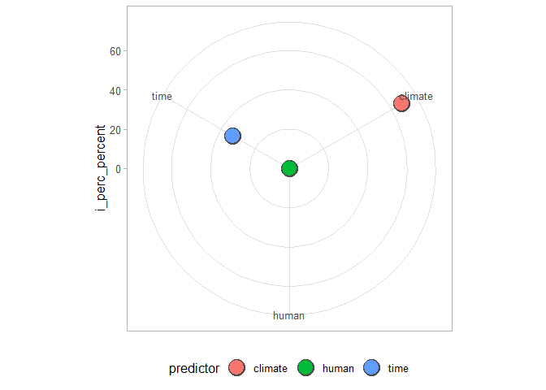
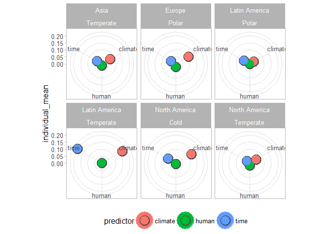
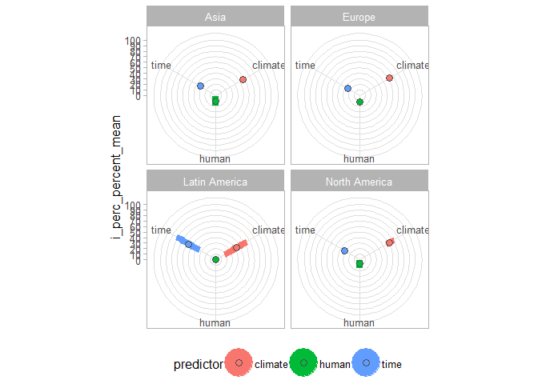
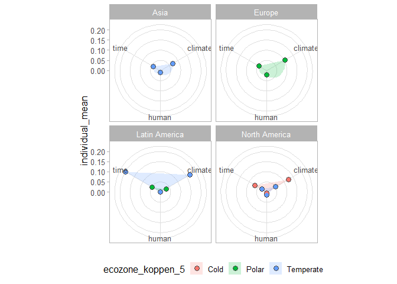
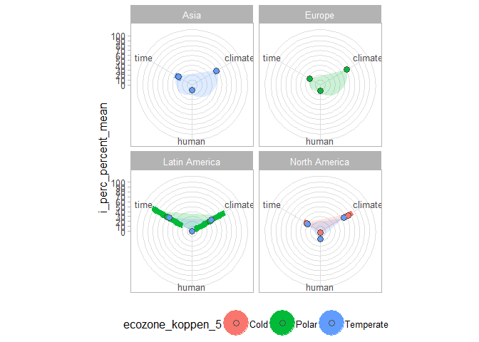
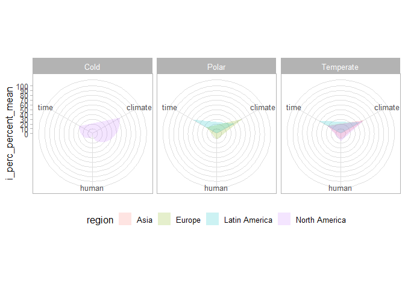

Visualisation of summed hVarPart
================

``` r
library(tidyverse)
library(usethis)
library(targets)
library(here)

# list R functions and source them
lapply(
  list.files(
    path = here::here("R/functions"),
    pattern = "*.R",
    recursive = TRUE,
    full.names = TRUE
  ),
  source
) %>%
  invisible()
```

``` r
# Define directory for external storage for users
auth_tibble <-
  tibble::tribble(
    ~name, ~path,
    "ondrej", "C:/Users/ondre/My Drive/"
  )

data_storage_path <-
  auth_tibble %>%
  dplyr::filter(name == Sys.info()["user"]) %>%
  purrr::pluck("path")

if (length(data_storage_path) > 1) {
  data_storage_path <- data_storage_path[2]
}

external_storage_targets <-
  paste0(
    data_storage_path,
    "_targets_h1"
  )

# set configuration for _target storage
targets::tar_config_set(
  store = external_storage_targets
)
```

## Load data

In order to do so, you have to have `data_to_run` in root folder

``` r
# get the data
data_to_run <- RUtilpol::get_latest_file("data_to_run")
```

    v Automatically loaded file
    data_to_run_2022-12-09__429e3f1ff6b24b23b9de0986dad16293__.rds

## Estimate hVArPart

Make a new data.frame with results of all records bind together

``` r
# get full output
data_varpart_output <-
  data_to_run$data_for_ord %>%
  rlang::set_names(
    nm = data_to_run$dataset_id
  ) %>%
  purrr::map_dfr(
    .id = "dataset_id",
    .f = ~ get_varhp(
      data_source = .x,
      reponse_vars = c(
        "n0", "n1", "n2",
        "n1_minus_n2", "n2_divided_by_n1", "n1_divided_by_n0",
        "roc",
        "dcca_axis_1"
      ),
      predictor_vars = list(
        human = c("spd"),
        climate = c(
          "temp_cold",
          "prec_summer",
          "prec_win",
          "gdm"
        ),
        time = c("age")
      ),
      run_all_predictors = FALSE,
      time_series = TRUE,
      get_significance = FALSE,
      permutations = 99
    ) %>%
      purrr::pluck("summary_table")
  ) %>%
  janitor::clean_names()

# add meta data
data_for_vis <-
  data_varpart_output %>%
  dplyr::inner_join(
    targets::tar_read(data_meta) %>%
      dplyr::select(dataset_id, lat, long, region, ecozone_koppen_5),
    by = "dataset_id"
  )
```

## Visualisation

### Individual record

Get plot for perctenage contribution for a single record

``` r
plot_circular(
  data_source = data_for_vis %>%
    dplyr::filter(
      dataset_id == "1758"
    ),
  y_var_name = "i_perc_percent"
)
```



### Multiple records

Get plot for individual contribution for each climate zone within
continent

``` r
plot_summed_circular(
  data_source = data_for_vis,
  group_vars = c("region", "ecozone_koppen_5"),
  sel_mode = "individual"
)
```



Get plot for perctenage contribution for each continent on a full scale
with error bars for 95-quantiles

``` r
plot_summed_circular(
  data_source = data_for_vis,
  group_vars = "region",
  col_var = "predictor",
  sel_mode = "i_perc_percent",
  add_error = "95%",
  point_size = 3,
  full_scale = TRUE
)
```



Get plot for individual contribution for each continent and color by
climate zone. Add polygon for mean values

``` r
plot_summed_circular(
  data_source = data_for_vis,
  group_vars = "region",
  col_var = "ecozone_koppen_5",
  sel_mode = "individual",
  add_error = FALSE,
  add_polygon = "mean",
  point_size = 3,
)
```



Get plot for perentage contribution for each continent and color by
climate zone. Add error bars by sd and polygon for 95-quantile values

``` r
plot_summed_circular(
  data_source = data_for_vis,
  group_vars = "region",
  col_var = "ecozone_koppen_5",
  sel_mode = "i_perc_percent",
  add_error = "sd",
  add_polygon = "95%",
  point_size = 3,
  full_scale = TRUE
)
```

    Warning: Removed 1 rows containing missing values (geom_segment).
    Removed 1 rows containing missing values (geom_segment).



Get plot for perentage contribution for each climate zone, colored by
continent. Add only polygons with mean value, no points

``` r
plot_summed_circular(
  data_source = data_for_vis,
  group_vars = "ecozone_koppen_5",
  col_var = "region",
  sel_mode = "i_perc_percent",
  add_error = FALSE,
  add_polygon = "mean",
  point_size = 0,
  full_scale = TRUE
)
```


